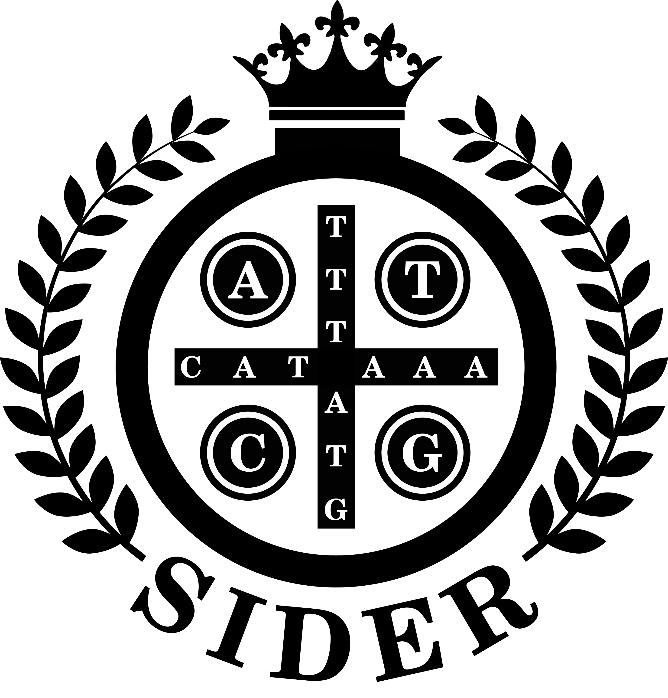

<p align="center"><a href="https://sideretro.readthedocs.io/en/latest/?badge=latest"></a></p>
<h2 align="center">A pipeline for detecting Somatic Insertion of DE novo RETROcopies</h2>

<p align="center">
  <a href="https://travis-ci.org/galantelab/sideRETRO"></a>
  <a href="https://sideretro.readthedocs.io/en/latest/?badge=latest"></a>
  <a href="https://coveralls.io/github/galantelab/sideRETRO?branch=master"></a>
  <a href="https://hub.docker.com/r/galantelab/sider"></a>
</p>

**sideRETRO** is a bioinformatic tool devoted for the detection of somatic (*de novo*) **retrocopy insertion**
in whole genome and whole exome sequencing data (WGS, WES). The program has been written from scratch in C, and
uses [HTSlib](http://www.htslib.org/) and [SQLite3](https://www.sqlite.org) libraries, in order to manage
SAM/BAM reading and data analysis.

## Functionalities

When detecting retrocopies, **sideRETRO** can annotate several other features related to each event:

* Parental gene

   The gene which underwent retrotransposition process.

* Host gene

   It may happen that the retrotransposition event is inserted into another gene.

* Genomic position

   The genome coordinate where occurred the retrocopy integration event (chromosome:start-end).
   It includes the insertion point (the expected exact point of each retrocopy insertion).

* Strandness

   Detects the orientation of the insertion (+/-). It takes into account the orientation of insertion,
   whether in the leading (+) or lagging (-) DNA strand.

* Genotype

   When multiple individuals (genomes) are analyzed, **sideRETRO** discriminates events found in each one.
   That way, it is possible to distinguish whether an event is exclusive or shared among the cohort analyzed.

* Haplotype

   Our tool provides information about the ploidy of the event, i.e., whether it occurs in one or both homologous
   chromosomes (homozygous or heterozygous).

## How it works

**sideRETRO** compiles to an executable called `sider`, which has three subcommands: `process-sample`, `merge-call`
and `make-vcf`. The `process-sample` subcommand processes a list of **SAM/BAM** files, and captures abnormal reads
that must be related to an event of retrocopy. All those data is saved to a **SQLite3 database** and then we come
to the second step `merge-call`, which processes the database and annotates all the retrocopies found. Finally we
can run the subcommand `make-vcf` and generate a file (in **VCF** format) with retrocopies and further information
about them. 

## Installation

The project depends on [Meson build system](https://mesonbuild.com) and [Ninja](https://github.com/ninja-build/ninja)
to manage configuration and compilation process. They can be obtained using package manager or from source. For example,
using [Ubuntu](https://ubuntu.com) distribution:

```
$ sudo apt-get install python3 \
                       python3-pip \
                       python3-setuptools \
                       python3-wheel \
                       ninja-build
```

and then:

`$ pip3 install --user meson`

Finally, clone this repository:

`$ git clone https://github.com/galantelab/sideRETRO.git`

Inside sideRETRO directory, run:

`$ meson build && ninja -C build`

You can find `sider` executable inside `build/src`. Optionally, install to system directories with:

`$ sudo ninja -C build install`

## Further reading

For more details about installation, usage, examples and our methodology, please take a look at the
online documentation: <https://sideretro.readthedocs.io>.

## Acknowledgments

- Coordination for the Improvement of Higher Level Personnel - [CAPES](http://www.capes.gov.br/)
