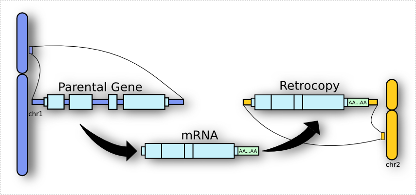

************
Introduction
************

**sideRETRO** is a bioinformatic tool devoted for the detection
of somatic (*de novo*) **retrocopy insertion** in whole genome
and whole exome sequencing data (WGS, WES). The program has been
written from scratch in C, and uses `HTSlib <http://www.htslib.org/>`_
and `SQLite3 <https://www.sqlite.org>`_ libraries, in order to
manage SAM/BAM reading and data analysis. The source code is
distributed under the **GNU General Public License**.

Wait, what is retrocopy?
========================

I can tell you now that retrocopy is a term used for the process
resulting from **reverse-transcription** of a mature **mRNA**
molecule into **cDNA**, and its insertion into a new position on
the genome.

Got interested? For a more detailed explanation about what is
a retrocopy at all, please see our section :ref:`Retrocopy in a
nutshell <chap_retrocopy>`.

Features
========

When detecting retrocopy mobilization, sideRETRO can annotate
several other features related to the event:

Parental gene
  The **gene** which **underwent retrotransposition** process,
  giving rise to the retrocopy.

Genomic position
  The genome **coordinate** where occured the retrocopy
  **integration** (chromosome:start-end). It includes the
  **insertion point**.

Strandness
  Detects the orientation of the insertion (+/-). It takes into
  account the orientation of insertion, whether in the
  **leading** (+) or **lagging** (-) DNA strand.

Genomic context
  The retrocopy integration site context: If the retrotransposition
  event occurred at an **intergenic** or **intragenic** region - the
  latter can be splitted into **exonic** and **intronic** according
  to the host gene.

Genotype
  When **multiple** individuals are analysed, annotate the
  events for each one. That way, it is possible to
  **distinguish** if an event is **exclusive** or **shared**
  among the cohort.

Haplotype
  Our tool provides information about the ploidy of the event,
  i.e., whether it occurs in one or both **homologous** chromosomes
  (homozygous or heterozygous).

How it works
============

sideRETRO compiles to an executable called :code:`sider`,
which has three subcommands: :code:`process-sample`,
:code:`merge-call` and :code:`make-vcf`. The :code:`process-sample`
subcommand reads a list of SAM/BAM files, and captures
**abnormal reads** that must be related to an event of retrocopy.
All those data is saved to a **SQLite3 database** and then we come
to the second step :code:`merge-call`, which **processes** the database
and **annotate** all the retrocopies found. Finally we can run the
subcommand :code:`make-vcf` and generate an annotated retrocopy
`VCF <https://samtools.github.io/hts-specs/VCFv4.2.pdf>`_.

.. code-block:: sh

   # List of BAM files
   $ cat 'my-bam-list.txt'
   /path/to/file1.bam
   /path/to/file2.bam
   /path/to/file3.bam
   ...

   # Run process-sample step
   $ sider process-sample \
     --annotation-file='my-annotation.gtf' \
     --input-file='my-bam-list.txt'

   $ ls -1
   my-genome.fa
   my-annotation.gtf
   my-bam-list.txt
   out.db

   # Run merge-call step
   $ sider merge-call --in-place out.db

   # Run make-vcf step
   $ sider make-vcf \
     --reference-file='my-genome.fa' out.db

Take a look at the manual page for :ref:`installation <chap_installation>`
and :ref:`usage <chap_usage>` information. Also for more details about
the algorithm, see our :ref:`methodology <chap_methodology>`.

Obtaining sideRETRO
===================

The source code for the program can be obtaining in the `github
<https://github.com/galantelab/sideRETRO>`_ page. From the command
line you can clone our repository::

  $ git clone https://github.com/galantelab/sideRETRO.git

No Warranty
===========

This program is distributed in the hope that it will be useful,
but WITHOUT ANY WARRANTY; without even the implied warranty of
MERCHANTABILITY or FITNESS FOR A PARTICULAR PURPOSE.  See the
`GNU General Public License
<https://www.gnu.org/licenses/gpl-3.0.en.html>`_
for more details.

Reporting Bugs
==============

If you find a bug, or have any issue, please inform us in the
`github issues tab <https://github.com/galantelab/sideRETRO/issues>`_.
All bug reports should include:

- The version number of sideRETRO
- A description of the bug behavior

Further Information
===================

If you need additional information, or a closer contact with the authors -
*we are always looking for coffee and good company* - contact us by email,
see :ref:`authors <chap_authors>`.

Our bioinformatic group has a site, feel free to make us a visit:
https://www.bioinfo.mochsl.org.br/.
