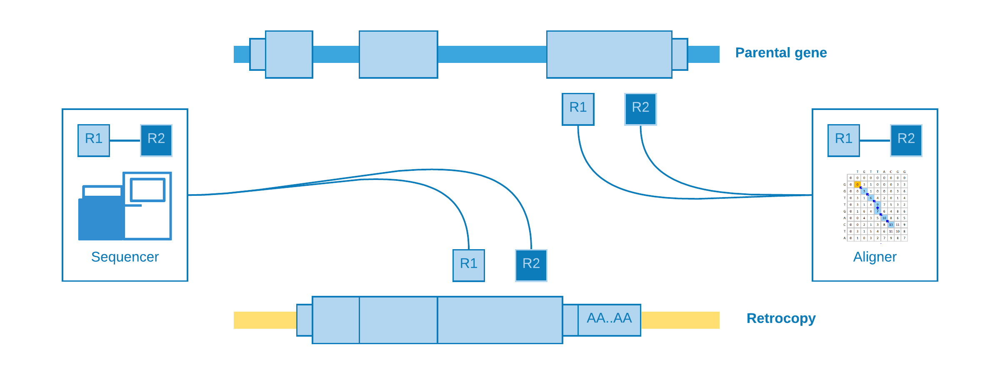
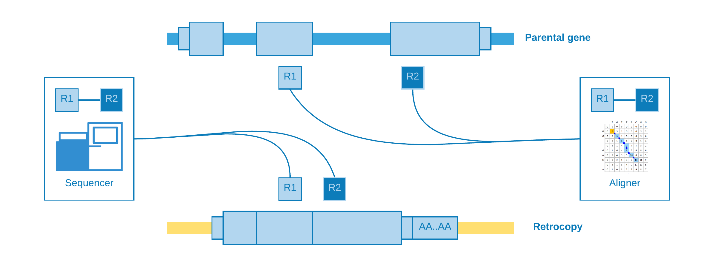
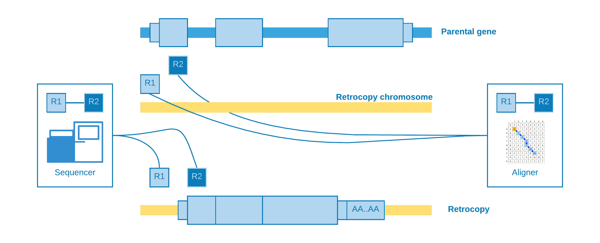
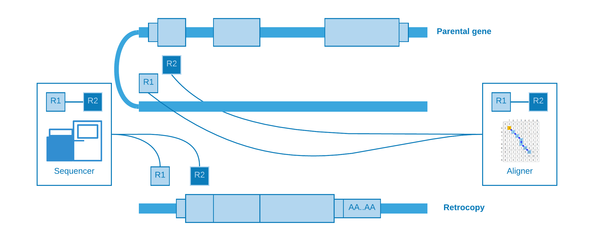
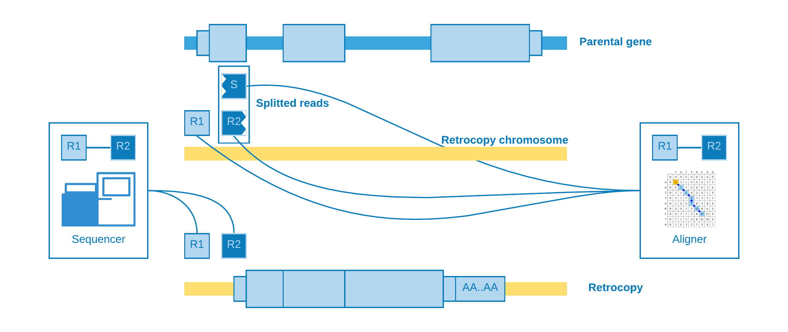
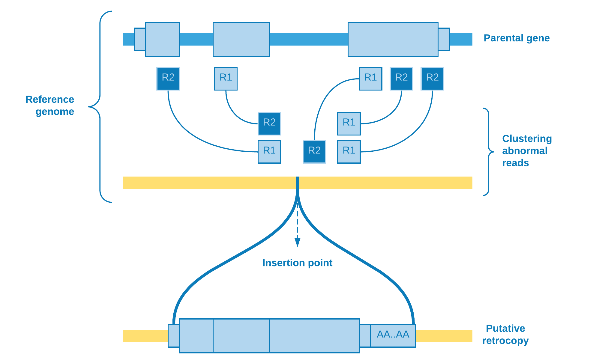
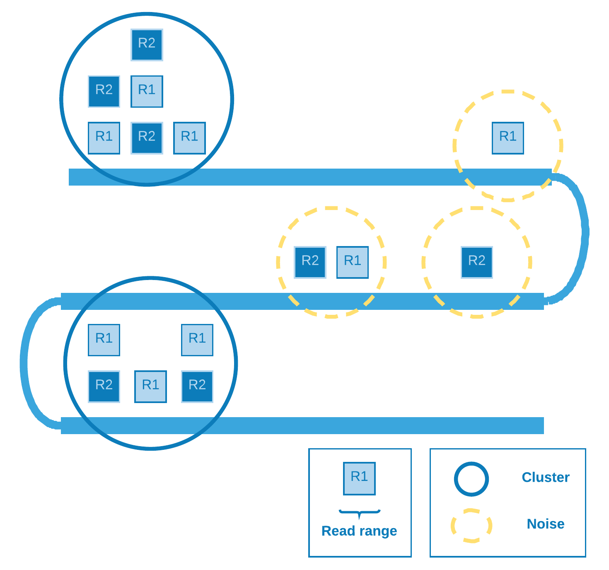
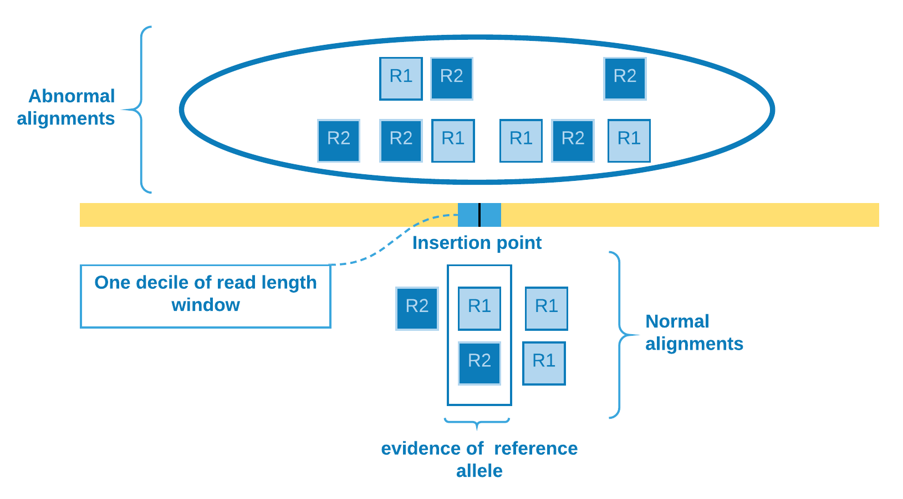

.. _chap_methodology:

***********
Methodology
***********

**siderRETRO** uses NGS (*Next Generation Sequencing*) data
to identify **unfixed** - *dimorphic/polymorphic, germinative,
or somatic* - retrocopies absent in the reference genome,
but present in the sequenced genome (by NGS).

Our **methodology** consists of detecting
abnormal (discordant) alignments in `SAM/BAM/CRAM
<https://samtools.github.io/hts-specs/SAMv1.pdf>`_
file and, with an **unsupervised machine learning**
algorithm, clustering these reads and genotype in order
to discover somatic retrocopy insertions. Care is taken
to ensure the quality and consistency of the data,
taking into account the features that characterize a
retrocopy mobilization, such as the absence of
**intronic** and **regulatory** regions.

.. note:: For more detail about the jargon, see `Retrocopy in a nutshell <retrocopy.rst>`_

Abnormal alignment
==================

When a structural variation, such as a retrotransposition,
occurs into an individual and her genome is sequenced with
a next-generation sequencing technology (e.g. `illumina
<https://www.illumina.com/>`_), we may **expect** that the
aligner (e.g. `BWA <http://bio-bwa.sourceforge.net/>`_,
`Bowtie <http://bowtie-bio.sourceforge.net/index.shtml>`_)
will be **confused** as to the origin of certain reads. As the
retrocopies come from a **mature mRNA**, reads from the
retrocopy may be **erroneously** aligned to an **exon** of the
**parental gene**:

These kind of alignment may be called **indistinguishable**,
because they do not give any **clue** about the presence of
the retrocopy. However, for our luck, there are reads
with abnormal (discordant) alignments which could be
helpful according to their characteristics:

- Paired-end reads aligned at **different** exons
- Paired-end reads aligned at **different** chromosomes
- Paired-end reads aligned at **distant** regions
- Splitted reads (Reads with **supplementary** alignment)

We will talk about each one as best as we can in the
next lines.

Alignment at different exons
----------------------------

When paired-end reads are mapped to contiguous exons and they
came from a genomic sequencing - which of course is not
expected.

This kind of alignment is useful for **assume** a
retrotransposition for the given parental gene, however it
is not possible to annotate the **genomic position** of the event.

Alignment at different chromosomes
------------------------------------

When the retrotransposition does not occur into the **same** parental
gene chromosome, it may happen that one read come from a **near**
intergenic region and its pair from the somatic **retrocopy**. As the
retrocopy **does not exist** in the reference genome, the aligner will
**map** one read to the retrotransposition chromosome and its pair to
the parental gene **exon**.

This alignment is useful to **estimate** the genomic position of the
event, but not with so much **precision** concerning to the **insertion
point**.

Alignment at distant regions
-----------------------------

If a retrocopy is inserted into the **same** chromosome of its parental
gene, possibly it will occur at a **distant** location. As well as
*"alignment at different chromosomes"*, one read may come from a near
intergenic region and its mate from the somatic retrocopy. So when
the aligner try to map these reads, we will observe that one fall
inside the parental gene exon, while its pair is mapped to a **distant
region**.

Splitted reads
--------------

The most **important** kind of alignment when detecting structural variations.
The splitted read may occur when **part** of the **same** read come from a near
intergenic region and part from the somatic retrocopy. When the aligner
**try** to map the read, it will need to **create** another one to represent
the splitted part, which is called **supplementary**.

This alignment is useful to detect the **insertion point** with a
**good precision**.

Taking all together
-------------------

We can resume all abnormal alignments according to their power
to detect the retrotransposition coordinate and its exact insertion
point:

+--------------------------+------------+-----------------+
| Abnormal alignments      | Coordinate | Insertion point |
+==========================+============+=================+
| At different exons       |     NO     |      NO         |
+--------------------------+------------+-----------------+
| At different chromosomes |     YES    |      NO         |
+--------------------------+------------+-----------------+
| At distant regions       |     YES    |      NO         |
+--------------------------+------------+-----------------+
| Splitted read            |     YES    |      YES        |
+--------------------------+------------+-----------------+

sideRETRO uses **only** the abnormal alignments **capable** to
detect **at least** the coordinate, so those that fall into
*different exons* are dismissed.

Clustering
==========

So far we have been talking about abnormal reads **selection**. As
soon as this step is over, we need to determine if a bunch of
reads aligned to some genomic region may **represent** a putative
retrocopy insertion. Therefore, firstly we restrict the abnormal
reads for those whose **mate is mapped** to a protein coding **exon**,
and then we **cluster** them according to the chromosome they mapped
to.

Wherefore, the clustering algorithm plays the role to resolve
if there really is a retrotransposition event. As the **number**
of reads **covering** the group is an important feature to take
into account, one possible choice of algorithm is **DBSCAN**.

DBSCAN
------

*Density Based Spatial Clustering of Applications with Noise* [1]_
is a density based clustering algorithm designed to discover cluster
in a **spatial database**. In our particular case, the database is
spatially of **one dimension** (the chromosome extension) and the
points are represented by the **range** comprising the mapped reads
start and end.

The denser (covered) the region the greater the chance of a
retrotransposition event there.

Genotype
========

In order to **increase** the putative insertion coverage, it is common
to **join** analysis of a bunch of individuals. After the discovery
of the retrocopies, it is necessary to identify **who owns** the
variation and with what **zygosity** ((heterozygous, homozygous).
So we have **three** possibilities for biallelic sites [2]_: If *A*
is the **reference** allele and *B* is the **alternate** allele, the
ordering of genotypes for the likelihoods is *AA*, *AB*, *BB*. The
**likelihoods** in turn is calculated based on *Heng Li* paper [3]_
with some assumptions that we are going to discuss.

Suppose at a given retrotransposition insertion point site there are
*k* reads. Let the first *l* reads identical to the reference genome
and the rest be different. The unphred alignment error probability of
the *j*-th read is :math:`\epsilon_{j}`. Assuming error independence,
we can derive that:

.. math::
   \delta(g) =
   \frac{1}{m^k}
   \prod_{j=1}^{l} [(m-g)\epsilon_{j}+g(1-\epsilon_{j})]
   \prod_{j=l+1}^{k} [(m-g)(1-\epsilon_{j})+g\epsilon_{j}]

where:

+-------------------+--------------------------------------------+
| :math:`\delta(g)` | Likelihoods for a given genotype           |
+-------------------+--------------------------------------------+
| :math:`m`         | Ploidy                                     |
+-------------------+--------------------------------------------+
| :math:`g`         | Genotype (the number of reference alleles) |
+-------------------+--------------------------------------------+

.. note::
   The way we are modeling the likelihoods probability **differs** a little
   bit from the **SNP calling** model: We are **treating** the *read* as the
   **unit**, not the *base*, therefore the error (:math:`\epsilon`) is the
   **mapping** quality (fifth column of SAM file), instead of the
   **sequencing** quality.

So we can summarize the formula for homozygous reference (HOR), heterozygous
(HET) and homozygous alternate (HOA):

HOR
  .. math::
     \delta(HOR) =
     \frac{1}{2^k}
     \prod_{j=1}^{l} 2(1-\epsilon_{j})
     \prod_{j=l+1}^{k} 2\epsilon_{j}

HET
  .. math::
     \delta(HET) =
     \frac{1}{2^k}

HOA
  .. math::
     \delta(HOA) =
     \frac{1}{2^k}
     \prod_{j=1}^{l} 2\epsilon_{j}
     \prod_{j=l+1}^{k} 2(1-\epsilon_{j})

We determine the insertion point site according to the abnormal alignments
clustering. Those *reads* will be used as the :math:`k - l` rest of the
*reads* which differs from reference genome. In order to verify if there
is evidence of reference allele, we need to come back to the SAM file and
check for the presence of *reads* **crossing** the insertion point. To
**mitigate** alignment error - which would otherwise overestimate the
number of reference allele *reads* - we select the *reads* that cover one
**decile** of *read* length window containing the insertion point. Then we
come to the :math:`l` *reads* **identical** to the reference genome and can
calculate the **genotype likelihoods**.

Orientation
===========

Other important information that can be obtained from the data is the
retrocopy **orientation** in relation to its parental gene. The abnormal
alignment *reads* give us the clue to solve this issue. We catch *reads*
when one pair aligns against an exon and its mate aligns to some genomic
region, so we can **sort** the *reads* from the exonic site and analyze
if their mates will be sorted in **ascending** or **descending** order as
result. If we observe that they are **directly** proportional, then we can
assume that the retrocopy is at the **same** parental gene strand, else they
are at **opposite** strands.

.. warning::
   This approach disregards the fact that there may have been structural variations,
   such as chromosomal inversions, which may invalidate these results.

Therefore summarizing:

* Retrocopy and its parental gene are at the same strand

  .. image:: images/orientation_same_strand.png
     :scale: 25%
     :align: center

* Retrocopy and its parental gene are at opposite strands

  .. image:: images/orientation_opposite_strand.png
     :scale: 25%
     :align: center

Spearman's rank correlation coefficient
---------------------------------------

We use *Spearman's rank correlation coefficient* [4]_ in order to have a
**measure** of relationship between *reads* from exon and their mates from
clustering site.  As our data is **nonparametric**, the Spearman's rho can
assess **monotonic** relationship, that is, it can tell us if the genomic
position of *reads* from exon **increases** when **does** the genomic
position of their *mates* from clustering site (positive rho) - or the
opposite (negative rho).

So we come to the following proposition:

+----------------------+---------+---------+
|                      | Retrocopy strand  |
| Parental gene strand +---------+---------+
|                      | rho > 0 | rho < 0 |
+======================+=========+=========+
|         \+           |   \+    |   \-    |
+----------------------+---------+---------+
|         \-           |   \-    |   \+    |
+----------------------+---------+---------+

References and Further Reading
==============================

.. [1] Ester, Martin. (1996).
   A Density-Based Algorithm for Discovering Clustersin Large Spatial Databases with Noise.
   KDD. Available at https://www.aaai.org/Papers/KDD/1996/KDD96-037.pdf.

.. [2] hts-specs. (2019).
   The Variant Call Format (VCF) Version 4.2 Specificatio.
   Available at https://samtools.github.io/hts-specs/VCFv4.2.pdf.

.. [3] Li, Heng (2011).
   A statistical framework for SNP calling, mutation discovery, association mapping and
   population genetical parameter estimation from sequencing data.
   Oxford University Press.

.. [4] Fieller, E. C., et al. (1957).
   Tests for Rank Correlation Coefficients. I.
   Biometrika, 44(3/4), 470–481. JSTOR.
   Available at https://www.jstor.org/stable/2332878.
