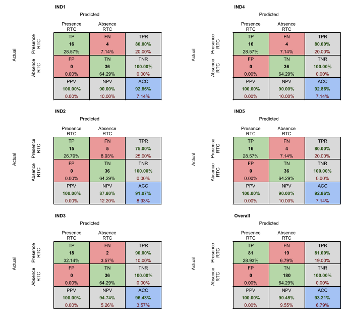
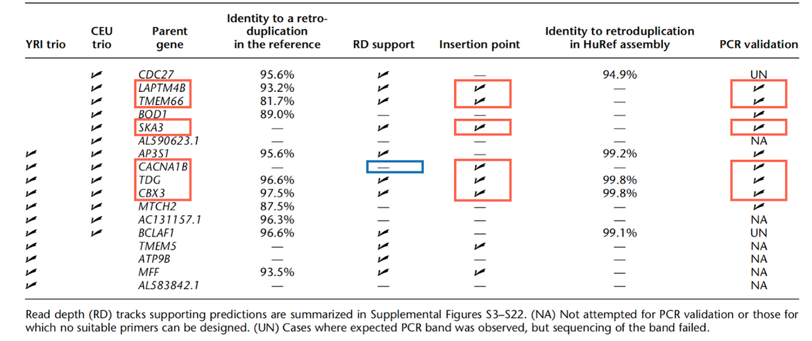
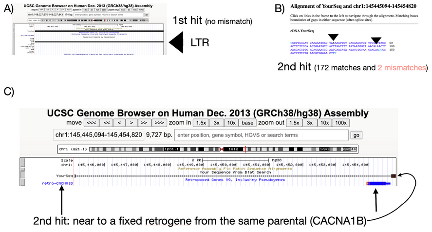

.. _chap_result2:

*******
Results
*******

.. note:: **retroCNVs** - *polymorphic retrocopies*

Simulated data
==============

Our dataset for testing is composed of 100 simulated human whole-genome
sequencing with 20x of depth and in average 30 randomly distributed
retrocopies each. Simulation with low coverage of ('only') 20x in
sequencing depth (i.e., heterozygotic events have only 10x coverage).
This strategy allowed us to check the capability of sideRETRO to identify
retroCNVs events even in a "non-ideal scenario" of low sequencing coverage.
In total, we had a list of 100 retrocopies consisting of the last 1000 bases
of the largest transcript of the parental gene - which were randomly raflled
as well. All retrocopies was stochastically designed for chromosome, position,
strand and zygosity.

The simulated retrocopy data is composed of three sets of retroCNVs events:

i) fixed or highly frequent events;

ii) polymorphic events (shared by some of the simulated genomes);

iii) somatic events (in only one genome) in simulation. It allowed us to check
sideRETRO performance for these different types of retroCNVs.

Simulation
----------

We developed a pipeline, which randomly generates our simulated dataset and
make some analysis of performance. All scripts can be downloaded at
:download:`simulation.tar.gz <data/simulation.tar.gz>`.  We used the
**SANDY** tool (version v0.23), *A straightforward and complete next-generation
sequencing read simulator* [2]_, for simulate all 100 genomes according to the
structural variations that we designed and according to the sampling. We used
the reference human genome v38 and the GENCODE annotation v32.

.. code-block:: sh

   REF_FASTA=/assets/hg38.fa
   PC_FASTA=/assets/gencode.v32.pc_transcripts.fa
   COHORT=100
   RTC_NUM=100
   LEN=1000
   DEPTH=20
   SANDY_SEED=1
   SEED=17

   # Genearte sequences
   scripts/catch \
     --seed=$SEED \
     --rtc_num=$RTC_NUM \
     --length=$LEN \
     "$PC_FASTA" > rtc_100.tsv

   # Build our cohort
   scripts/build \
     --cohort=$COHORT \
     --seed=$SEED \
     --output-dir=build \
     "$REF_FASTA" \
     rtc_100.tsv

   # Retrocopies by individual
   IND=($(ls build/*.sandy))

   # Load build values to SANDY
   for ind in "${IND[@]}"; do
     sandy variation add \
       --structural-variation=$(basename $ind '.sandy') \
       $ind
   done

   mkdir -p sim

   # Simulate all genomes
   for ind in "${IND[@]}"; do
     sandy_index=$(basename $ind '.sandy')
     sandy genome \
       --id='%i.%U_%c:%S-%E_%v' \
       --structural-variation=$sandy_index \
       --output-dir="sim/$sandy_index" \
       --jobs=20 \
       --seed=$SANDY_SEED \
       --quality-profile='hiseq_101' \
       --coverage=$DEPTH \
       --verbose \
       $REF_FASTA
   done

As result we have a pair of FASTQ files (forward and reverse complement) for
each simulated individual. Next it is required to align our sequencing data
against the human reference genome in order to generate mapped files in SAM
format. We used BWA aligner (version 0.7.9) [3]_ for accomplish this task.

.. code-block:: sh

   # Individual directories with the
   # simulated data
   IND_DIR=($(ls -d sim/*))

   # Reference genome
   REF_FASTA="/assets/hg38.fa"

   # Index reference genome
   bwa index $REF_FASTA

   mkdir -p align

   # Alignment
   for ind in "${IND[@]}"; do
     id="$(basename $ind)"
     bwa mem \
       -t 10 \
       $REF_FASTA \
       $ind/out_R1_001.fastq.gz \
       $ind/out_R2_001.fastq.gz > "align/$id.sam"
   done

After our simulated dataset was ready, we run sideRETRO v0.14.1:

.. code-block:: sh

   # Our simulated SAM files list
   LIST=($(ls align/*.sam))

   # GENCODE annotation v32
   ANNOTATION=/assets/gencode.v32.annotation.gff3

   # GENCODE reference genome
   REF_FASTA=/assets/hg38.fa

   # Run process-sample step
   sider process-sample \
     --prefix=sim \
     --cache-size=20000000 \
     --output-dir=sider \
     --threads=20 \
     --alignment-frac=0.9 \
     --phred-quality=20 \
     --sorted \
     --log-file=ps.log \
     --annotation-file=$ANNOTATION \
     "${LIST[@]}"

   # Run merge-call step
   sider merge-call \
     --cache-size=20000000 \
     --epsilon=500 \
     --min-pts=10 \
     --log-file=mc.log \
     --threads=20 \
     --phred-quality=20 \
     --in-place \
     sider/sim.db

   # Finally run make-vcf
   sider make-vcf \
     --log-file=vcf.log \
     --reference-file=$REF_FASTA \
     --prefix=sim \
     --output-dir=sider \
     sider/sim.db

Finally, with the sideRETRO's VCF made, we analysed the performance:

.. code-block:: sh

   # Generate comparations for analysis
   scripts/compare sider/sim.vcf build

   # Confusion analysis
   scripts/confusion analysis > confusion.tsv

   # Just a look
   $ column -t confusion.tsv | head
   IND                TP  FP  FN   PPV/Precision  TPR/Recall  F1-score
   analysis/ind0.tsv  38  0   9    1.000000       0.808511    0.894118
   analysis/ind1.tsv  36  2   11   0.947368       0.765957    0.847059
   analysis/ind2.tsv  33  1   10   0.970588       0.767442    0.857143
   analysis/ind3.tsv  35  1   12   0.972222       0.744681    0.843373
   analysis/ind4.tsv  29  1   9    0.966667       0.763158    0.852941
   analysis/ind5.tsv  37  4   12   0.902439       0.755102    0.822222
   analysis/ind6.tsv  45  0   10   1.000000       0.818182    0.900000
   analysis/ind7.tsv  37  2   11   0.948718       0.770833    0.850575
   analysis/ind8.tsv  32  2   11   0.941176       0.744186    0.831169

Analysis
--------

.. table:: Summary of the set of 100 simulated retroCNVs. Simulated retroCNV events
   were randomly inserted in the human genome (GRCh38). Here, we present their parental
   gene name, the insertion point, polarity (Pol). All events found (79 retroCNVs) and
   not found (21 retroCNVs) are presented, as well as addition information about their
   insertion point (considering a region of 100bp around its position)
   :widths: auto

   +-----------+---------------------------------------+---------------------------+
   |           | SIMULATED                             | FOUND (79 events)         |
   |           +--------+------------+-----+-----------+--------+------------+-----+
   | Parental  |        |            |     | LINE/SINE |        |            |     |
   | Gene      | Chr    | Position   | Pol |           | Chr    | Position   | Pol |
   +===========+========+============+=====+===========+========+============+=====+
   | ALG2      | chr10  | 30778982   | \-  | N         | chr10  | 30778981   | \-  |
   +-----------+--------+------------+-----+-----------+--------+------------+-----+
   | ARMC2     | chr5   | 52723637   | \-  | Y         | chr5   | 52723638   | \-  |
   +-----------+--------+------------+-----+-----------+--------+------------+-----+
   | ATG2B     | chr5   | 177026995  | \-  | N         | chr5   | 177026990  | \-  |
   +-----------+--------+------------+-----+-----------+--------+------------+-----+
   | BTF3      | chr7   | 146774631  | \-  | N         | chr7   | 146774629  | \-  |
   +-----------+--------+------------+-----+-----------+--------+------------+-----+
   | C2orf92   | chr6   | 112158328  | \-  | N         | chr6   | 112158327  | \-  |
   +-----------+--------+------------+-----+-----------+--------+------------+-----+
   | C8orf76   | chr9   | 94927085   | \-  | N         | chr9   | 94927084   | \-  |
   +-----------+--------+------------+-----+-----------+--------+------------+-----+
   | C9orf64   | chr17  | 40139106   | \+  | Y         | chr17  | 40139104   | \+  |
   +-----------+--------+------------+-----+-----------+--------+------------+-----+
   | CABP7     | chr5   | 153788597  | \+  | Y         | chr5   | 153788596  | \+  |
   +-----------+--------+------------+-----+-----------+--------+------------+-----+
   | CARD8     | chrX   | 99922659   | \+  | N         | chrX   | 99922658   | \+  |
   +-----------+--------+------------+-----+-----------+--------+------------+-----+
   | CASTOR3   | chr3   | 189081695  | \-  | N         | chr3   | 189081692  | \-  |
   +-----------+--------+------------+-----+-----------+--------+------------+-----+
   | CDH22     | chr9   | 113306486  | \-  | Y         | chr9   | 113306485  | \-  |
   +-----------+--------+------------+-----+-----------+--------+------------+-----+
   | CFAP69    | chr11  | 10733916   | \-  | N         | chr11  | 10733915   | \-  |
   +-----------+--------+------------+-----+-----------+--------+------------+-----+
   | COL4A3    | chr16  | 46427444   | \+  | N         | chr16  | 46427444   | \+  |
   +-----------+--------+------------+-----+-----------+--------+------------+-----+
   | COPS2     | chr1   | 38773310   | \-  | Y         | chr1   | 38773309   | \-  |
   +-----------+--------+------------+-----+-----------+--------+------------+-----+
   | CPNE7     | chr9   | 42228417   | \+  | Y         | chr9   | 42228469   | .   |
   +-----------+--------+------------+-----+-----------+--------+------------+-----+
   | DENND2D   | chr18  | 37314709   | \+  | N         | chr18  | 37314708   | \+  |
   +-----------+--------+------------+-----+-----------+--------+------------+-----+
   | DNAJC27   | chr12  | 60940050   | \-  | N         | chr12  | 60940049   | \-  |
   +-----------+--------+------------+-----+-----------+--------+------------+-----+
   | EPC2      | chr13  | 94468157   | \-  | N         | chr13  | 94468156   | \-  |
   +-----------+--------+------------+-----+-----------+--------+------------+-----+
   | EPS8      | chr21  | 26428011   | \+  | N         | chr21  | 26428011   | \+  |
   +-----------+--------+------------+-----+-----------+--------+------------+-----+
   | ERCC4     | chr6   | 93262920   | \+  | N         | chr6   | 93262919   | \+  |
   +-----------+--------+------------+-----+-----------+--------+------------+-----+
   | FAAP20    | chr9   | 77384901   | \-  | N         | chr9   | 77384898   | \-  |
   +-----------+--------+------------+-----+-----------+--------+------------+-----+
   | FAM177B   | chr12  | 130498191  | \+  | N         | chr12  | 130498188  | \+  |
   +-----------+--------+------------+-----+-----------+--------+------------+-----+
   | FAM71E2   | chr2   | 225319689  | \+  | N         | chr2   | 225319688  | \+  |
   +-----------+--------+------------+-----+-----------+--------+------------+-----+
   | HAO2      | chr14  | 69901152   | \+  | N         | chr14  | 69901150   | \+  |
   +-----------+--------+------------+-----+-----------+--------+------------+-----+
   | HEG1      | chr3   | 15517386   | \-  | Y         | chr3   | 15517382   | \-  |
   +-----------+--------+------------+-----+-----------+--------+------------+-----+
   | HIP1      | chr8   | 75177754   | \+  | Y         | chr8   | 75177754   | \+  |
   +-----------+--------+------------+-----+-----------+--------+------------+-----+
   | IL1R1     | chr8   | 30386429   | \-  | N         | chr8   | 30386427   | \-  |
   +-----------+--------+------------+-----+-----------+--------+------------+-----+
   | IQGAP3    | chr6   | 124358143  | \+  | Y         | chr6   | 124358101  | \+  |
   +-----------+--------+------------+-----+-----------+--------+------------+-----+
   | KIF7      | chrX   | 89251626   | \-  | Y         | chrX   | 89251603   | \-  |
   +-----------+--------+------------+-----+-----------+--------+------------+-----+
   | LAMP1     | chr13  | 87908197   | \-  | N         | chr13  | 87908197   | \-  |
   +-----------+--------+------------+-----+-----------+--------+------------+-----+
   | LARS      | chr9   | 64069435   | \+  | Y         | chr9   | 64069377   | \+  |
   +-----------+--------+------------+-----+-----------+--------+------------+-----+
   | LRRC6     | chr4   | 180728002  | \-  | N         | chr4   | 180728002  | \-  |
   +-----------+--------+------------+-----+-----------+--------+------------+-----+
   | MACROD2   | chr20  | 18178487   | \+  | N         | chr20  | 18178486   | \+  |
   +-----------+--------+------------+-----+-----------+--------+------------+-----+
   | MYH10     | chr4   | 186290075  | \+  | Y         | chr4   | 186290074  | \+  |
   +-----------+--------+------------+-----+-----------+--------+------------+-----+
   | MYH7B     | chr13  | 104241206  | \+  | N         | chr13  | 104241205  | \+  |
   +-----------+--------+------------+-----+-----------+--------+------------+-----+
   | MYO7A     | chr11  | 14072547   | \+  | N         | chr11  | 14072546   | \+  |
   +-----------+--------+------------+-----+-----------+--------+------------+-----+
   | NAE1      | chr18  | 74528384   | \+  | Y         | chr18  | 74528383   | \+  |
   +-----------+--------+------------+-----+-----------+--------+------------+-----+
   | OR14A16   | chr1   | 52758590   | \+  | N         | chr1   | 52758589   | \+  |
   +-----------+--------+------------+-----+-----------+--------+------------+-----+
   | OR51M1    | chr2   | 37409208   | \-  | N         | chr2   | 37409207   | \-  |
   +-----------+--------+------------+-----+-----------+--------+------------+-----+
   | OSER1     | chr5   | 53846631   | \-  | Y         | chr5   | 53846596   | \-  |
   +-----------+--------+------------+-----+-----------+--------+------------+-----+
   | PAFAH1B1  | chr15  | 86208543   | \+  | Y         | chr15  | 86208562   | \+  |
   +-----------+--------+------------+-----+-----------+--------+------------+-----+
   | PDGFB     | chr8   | 133462380  | \-  | N         | chr8   | 133462379  | \-  |
   +-----------+--------+------------+-----+-----------+--------+------------+-----+
   | PFKFB2    | chr5   | 36822019   | \-  | N         | chr5   | 36822019   | \-  |
   +-----------+--------+------------+-----+-----------+--------+------------+-----+
   | PLCB1     | chr9   | 25165703   | \+  | Y         | chr9   | 25165702   | \+  |
   +-----------+--------+------------+-----+-----------+--------+------------+-----+
   | PNRC1     | chr15  | 48607415   | \+  | N         | chr15  | 48607414   | \+  |
   +-----------+--------+------------+-----+-----------+--------+------------+-----+
   | PRMT2     | chr8   | 50511539   | \-  | Y         | chr8   | 50511540   | \-  |
   +-----------+--------+------------+-----+-----------+--------+------------+-----+
   | PRPF18    | chr20  | 51460729   | \+  | Y         | chr20  | 51460728   | \+  |
   +-----------+--------+------------+-----+-----------+--------+------------+-----+
   | PRSS45P   | chr19  | 5420707    | \-  | Y         | chr19  | 5420706    | \-  |
   +-----------+--------+------------+-----+-----------+--------+------------+-----+
   | PTPRF     | chr19  | 7227546    | \+  | Y         | chr19  | 7227546    | \+  |
   +-----------+--------+------------+-----+-----------+--------+------------+-----+
   | RAB18     | chr4   | 10281361   | \-  | N         | chr4   | 10281361   | \-  |
   +-----------+--------+------------+-----+-----------+--------+------------+-----+
   | RAB5B     | chr6   | 46561322   | \+  | N         | chr6   | 46561322   | \+  |
   +-----------+--------+------------+-----+-----------+--------+------------+-----+
   | RADX      | chr12  | 117277769  | \+  | N         | chr12  | 117277768  | \+  |
   +-----------+--------+------------+-----+-----------+--------+------------+-----+
   | RASGEF1C  | chr5   | 115992817  | \+  | N         | chr5   | 115992816  | \+  |
   +-----------+--------+------------+-----+-----------+--------+------------+-----+
   | RBM4      | chr7   | 101199285  | \+  | Y         | chr7   | 101199284  | \+  |
   +-----------+--------+------------+-----+-----------+--------+------------+-----+
   | RMDN3     | chr3   | 28655572   | \-  | N         | chr3   | 28655571   | \-  |
   +-----------+--------+------------+-----+-----------+--------+------------+-----+
   | RNF6      | chr4   | 39797761   | \-  | Y         | chr4   | 39797759   | \-  |
   +-----------+--------+------------+-----+-----------+--------+------------+-----+
   | SART1     | chr2   | 109317943  | \+  | N         | chr2   | 109317942  | \+  |
   +-----------+--------+------------+-----+-----------+--------+------------+-----+
   | SDHA      | chr4   | 179658356  | \+  | N         | chr4   | 179658355  | \+  |
   +-----------+--------+------------+-----+-----------+--------+------------+-----+
   | SEZ6L     | chr18  | 560651     | \-  | Y         | chr18  | 560650     | \-  |
   +-----------+--------+------------+-----+-----------+--------+------------+-----+
   | SKP2      | chr5   | 88746051   | \-  | N         | chr5   | 88746050   | \-  |
   +-----------+--------+------------+-----+-----------+--------+------------+-----+
   | SLC9A3    | chr4   | 140369141  | \-  | N         | chr4   | 140369139  | \-  |
   +-----------+--------+------------+-----+-----------+--------+------------+-----+
   | SMTNL2    | chr3   | 144112843  | \-  | N         | chr3   | 144112842  | \-  |
   +-----------+--------+------------+-----+-----------+--------+------------+-----+
   | SNRNP27   | chrX   | 13251389   | \-  | N         | chrX   | 13251387   | \-  |
   +-----------+--------+------------+-----+-----------+--------+------------+-----+
   | STK17B    | chrX   | 36995058   | \-  | Y         | chrX   | 36995057   | \-  |
   +-----------+--------+------------+-----+-----------+--------+------------+-----+
   | TACO1     | chrY   | 12987416   | \+  | Y         | chrY   | 12987415   | \+  |
   +-----------+--------+------------+-----+-----------+--------+------------+-----+
   | TMEM63C   | chr17  | 49131966   | \+  | Y         | chr17  | 49131965   | \+  |
   +-----------+--------+------------+-----+-----------+--------+------------+-----+
   | TMEM95    | chr2   | 234301985  | \-  | Y         | chr2   | 234301984  | \-  |
   +-----------+--------+------------+-----+-----------+--------+------------+-----+
   | TSFM      | chr12  | 80384739   | \-  | Y         | chr12  | 80384736   | \-  |
   +-----------+--------+------------+-----+-----------+--------+------------+-----+
   | TUBGCP2   | chr1   | 197233691  | \+  | N         | chr1   | 197233690  | \+  |
   +-----------+--------+------------+-----+-----------+--------+------------+-----+
   | VIPAS39   | chr12  | 54021508   | \-  | N         | chr12  | 54021507   | \-  |
   +-----------+--------+------------+-----+-----------+--------+------------+-----+
   | WDR74     | chr11  | 112552782  | \-  | N         | chr11  | 112552781  | \-  |
   +-----------+--------+------------+-----+-----------+--------+------------+-----+
   | WDR75     | chr6   | 132636317  | \+  | Y         | chr6   | 132636316  | \+  |
   +-----------+--------+------------+-----+-----------+--------+------------+-----+
   | ZNF136    | chr16  | 59509103   | \+  | Y         | chr16  | 59509104   | \+  |
   +-----------+--------+------------+-----+-----------+--------+------------+-----+
   | ZNF326    | chr8   | 29273486   | \-  | Y         | chr8   | 29273482   | \-  |
   +-----------+--------+------------+-----+-----------+--------+------------+-----+
   | ZNF385A   | chr12  | 92752469   | \-  | N         | chr12  | 92752468   | \-  |
   +-----------+--------+------------+-----+-----------+--------+------------+-----+
   | ZNF431    | chr16  | 88101015   | \-  | N         | chr16  | 88101015   | \-  |
   +-----------+--------+------------+-----+-----------+--------+------------+-----+
   | ZNF585A   | chr18  | 78888223   | \-  | Y         | chr18  | 78888222   | \-  |
   +-----------+--------+------------+-----+-----------+--------+------------+-----+
   | ZNF738    | chr6   | 139608184  | \-  | N         | chr6   | 139608183  | \-  |
   +-----------+--------+------------+-----+-----------+--------+------------+-----+
   | ZNF793    | chr9   | 120420222  | \+  | N         | chr9   | 120420223  | \+  |
   +-----------+--------+------------+-----+-----------+--------+------------+-----+
   | RetroCNV events not found by sideRetro (21 events)                            |
   +---------------------------------------------------+---------------------------+
   |                                                   | Duplicated region         |
   +-----------+--------+------------+-----+-----------+---------------------------+
   | AC002310.4| chr9   | 94545202   | \-  | N         | chr8:115819078-115819180  |
   +-----------+--------+------------+-----+-----------+---------------------------+
   | AC135178.3| chr7   | 74794901   | \-  | N         | chr7:75151009-75151108    |
   +-----------+--------+------------+-----+-----------+---------------------------+
   | ACSBG2    | chr21  | 43058887   | \-  | N         | chr21:6450515-6450614     |
   +-----------+--------+------------+-----+-----------+---------------------------+
   | ADD2      | chr3   | 9759497    | \+  | N         | No                        |
   +-----------+--------+------------+-----+-----------+---------------------------+
   | AL645922.1| chr6   | 38626680   | \-  | N         | No                        |
   +-----------+--------+------------+-----+-----------+---------------------------+
   | C21orf91  | chr14  | 54886570   | \-  | Y         | Duplications: 7x genome   |
   +-----------+--------+------------+-----+-----------+---------------------------+
   | CERS1     | chr20  | 41341204   | \+  | N         | No                        |
   +-----------+--------+------------+-----+-----------+---------------------------+
   | CWC25     | chr13  | 39475646   | \-  | N         | No                        |
   +-----------+--------+------------+-----+-----------+---------------------------+
   | DHRSX     | chr5   | 166496220  | \-  | Y         | Highly repetitive region  |
   +-----------+--------+------------+-----+-----------+---------------------------+
   | LETM1     | chrY   | 24793930   | \-  | N         | 8 identical region in chrY|
   +-----------+--------+------------+-----+-----------+---------------------------+
   | MALL      | chr7   | 110598366  | \+  | N         | No                        |
   +-----------+--------+------------+-----+-----------+---------------------------+
   | MRPS7     | chr2   | 1490696    | \+  | N         | chr2_KI270774v1_alt       |
   +-----------+--------+------------+-----+-----------+---------------------------+
   | MTNR1A    | chr8   | 86938090   | \-  | N         | chrX, chr4                |
   +-----------+--------+------------+-----+-----------+---------------------------+
   | NDUFA6    | chr10  | 38060463   | \+  | N         | chr10:42588649-42588750   |
   +-----------+--------+------------+-----+-----------+---------------------------+
   | PLAC8     | chr9   | 39225441   | \+  | Y         | chr9:61393599-61393698    |
   +-----------+--------+------------+-----+-----------+---------------------------+
   | PTCHD4    | chr15  | 31035142   | \-  | Y         | chr15_KI270905v1_alt      |
   +-----------+--------+------------+-----+-----------+---------------------------+
   | SLC44A4   | chrY   | 4417954    | \+  | Y         | chrX:90835484-90835583    |
   +-----------+--------+------------+-----+-----------+---------------------------+
   | STON2     | chrX   | 468106     | \+  | N         | chrY:468056-468155        |
   +-----------+--------+------------+-----+-----------+---------------------------+
   | TAF7      | chr22  | 22384919   | \-  | N         | chr22_KI270875v1_alt      |
   +-----------+--------+------------+-----+-----------+---------------------------+
   | TBC1D3F   | chr16  | 65760883   | \+  | Y         | No                        |
   +-----------+--------+------------+-----+-----------+---------------------------+
   | TRIM40    | chr5   | 45713519   | \+  | N         | No                        |
   +-----------+--------+------------+-----+-----------+---------------------------+

.. table:: sideRETRO capability to identify simulated retroCNVs common (present in
   all simulated genomes), polymorphic (events present in > 2 genmes) and somatic
   (events present in only an individual genome).
   :widths: auto

   +---------------+-----------------------+--------------+----+
   | RetroCNV type | # of simulated events | Found events | %  |
   +===============+=======================+==============+====+
   | Common        | 25                    | 19           | 76 |
   +---------------+-----------------------+--------------+----+
   | Polymorphic   | 50                    | 42           | 84 |
   +---------------+-----------------------+--------------+----+
   | Somatic       | 25                    | 18           | 72 |
   +---------------+-----------------------+--------------+----+

.. table:: sideRetro performance in identifying simulated retroCNVs. It
   is shown gene genome coverage, the true positive, false negative,
   false positive, precision, recall and F1-score considering all
   simulated retroCNVs (*) and also using those 86 events (**) inserted
   in mappeable (non ambiguous) genomic regions. These scores are given
   to the full set of 100 simulated genomes.
   :widths: auto

   +-------+------+-----+-----------+------+-------------+------------+
   | Ind   | TP   | FP  | FN*       | PPV  | TPR (*\|**) | F1 (*\|**) |
   +=======+======+=====+===========+======+=============+============+
   | 0     | 38   |  0  | 9\|5      | 1.00 | 0.81\|0.88  | 0.89\|0.94 |
   +-------+------+-----+-----------+------+-------------+------------+
   | 1     | 36   |  2  | 11\|7     | 0.95 | 0.77\|0.84  | 0.85\|0.89 |
   +-------+------+-----+-----------+------+-------------+------------+
   | 2     | 33   |  1  | 10\|6     | 0.97 | 0.77\|0.85  | 0.86\|0.90 |
   +-------+------+-----+-----------+------+-------------+------------+
   | 3     | 35   |  1  | 12\|5     | 0.97 | 0.74\|0.88  | 0.84\|0.92 |
   +-------+------+-----+-----------+------+-------------+------------+
   | 4     | 29   |  1  | 9\|5      | 0.97 | 0.76\|0.85  | 0.85\|0.91 |
   +-------+------+-----+-----------+------+-------------+------------+
   | 5     | 37   |  4  | 12\|5     | 0.90 | 0.76\|0.88  | 0.82\|0.89 |
   +-------+------+-----+-----------+------+-------------+------------+
   | 6     | 45   |  0  | 10\|6     | 1.00 | 0.82\|0.88  | 0.90\|0.94 |
   +-------+------+-----+-----------+------+-------------+------------+
   | 7     | 37   |  2  | 11\|5     | 0.95 | 0.77\|0.88  | 0.85\|0.91 |
   +-------+------+-----+-----------+------+-------------+------------+
   | 8     | 32   |  2  | 11\|5     | 0.94 | 0.74\|0.86  | 0.83\|0.90 |
   +-------+------+-----+-----------+------+-------------+------------+
   | 9     | 33   |  3  | 11\|5     | 0.92 | 0.75\|0.87  | 0.83\|0.89 |
   +-------+------+-----+-----------+------+-------------+------------+
   | 10    | 34   |  1  | 9\|5      | 0.97 | 0.79\|0.87  | 0.87\|0.92 |
   +-------+------+-----+-----------+------+-------------+------------+
   | 11    | 37   |  2  | 12\|5     | 0.95 | 0.76\|0.88  | 0.84\|0.91 |
   +-------+------+-----+-----------+------+-------------+------------+
   | 12    | 30   |  1  | 10\|5     | 0.97 | 0.75\|0.86  | 0.85\|0.91 |
   +-------+------+-----+-----------+------+-------------+------------+
   | 13    | 43   |  3  | 11\|5     | 0.93 | 0.80\|0.90  | 0.86\|0.91 |
   +-------+------+-----+-----------+------+-------------+------------+
   | 14    | 38   |  0  | 10\|6     | 1.00 | 0.79\|0.86  | 0.88\|0.93 |
   +-------+------+-----+-----------+------+-------------+------------+
   | 15    | 31   |  1  | 8\|5      | 0.97 | 0.79\|0.86  | 0.87\|0.91 |
   +-------+------+-----+-----------+------+-------------+------------+
   | 16    | 30   |  4  | 13\|6     | 0.88 | 0.70\|0.83  | 0.78\|0.86 |
   +-------+------+-----+-----------+------+-------------+------------+
   | 17    | 39   |  1  | 9\|5      | 0.98 | 0.81\|0.89  | 0.89\|0.93 |
   +-------+------+-----+-----------+------+-------------+------------+
   | 18    | 37   |  0  | 10\|5     | 1.00 | 0.79\|0.88  | 0.88\|0.94 |
   +-------+------+-----+-----------+------+-------------+------------+
   | 19    | 39   |  1  | 10\|6     | 0.98 | 0.80\|0.87  | 0.88\|0.92 |
   +-------+------+-----+-----------+------+-------------+------------+
   | 20    | 39   |  2  | 12\|6     | 0.95 | 0.76\|0.87  | 0.85\|0.91 |
   +-------+------+-----+-----------+------+-------------+------------+
   | 21    | 42   |  3  | 12\|5     | 0.93 | 0.78\|0.89  | 0.85\|0.91 |
   +-------+------+-----+-----------+------+-------------+------------+
   | 22    | 39   |  0  | 10\|6     | 1.00 | 0.80\|0.87  | 0.89\|0.93 |
   +-------+------+-----+-----------+------+-------------+------------+
   | 23    | 41   |  2  | 10\|5     | 0.95 | 0.80\|0.89  | 0.87\|0.92 |
   +-------+------+-----+-----------+------+-------------+------------+
   | 24    | 43   |  1  | 8\|5      | 0.98 | 0.84\|0.90  | 0.91\|0.93 |
   +-------+------+-----+-----------+------+-------------+------------+
   | 25    | 41   |  0  | 9\|6      | 1.00 | 0.82\|0.87  | 0.90\|0.93 |
   +-------+------+-----+-----------+------+-------------+------------+
   | 26    | 43   |  0  | 10\|6     | 1.00 | 0.81\|0.88  | 0.90\|0.93 |
   +-------+------+-----+-----------+------+-------------+------------+
   | 27    | 34   |  0  | 10\|5     | 1.00 | 0.77\|0.87  | 0.87\|0.93 |
   +-------+------+-----+-----------+------+-------------+------------+
   | 28    | 38   |  4  | 14\|7     | 0.90 | 0.73\|0.84  | 0.81\|0.87 |
   +-------+------+-----+-----------+------+-------------+------------+
   | 29    | 36   |  1  | 11\|6     | 0.97 | 0.77\|0.86  | 0.86\|0.91 |
   +-------+------+-----+-----------+------+-------------+------------+
   | 30    | 47   |  3  | 11\|5     | 0.94 | 0.81\|0.90  | 0.87\|0.92 |
   +-------+------+-----+-----------+------+-------------+------------+
   | 31    | 43   |  3  | 12\|5     | 0.93 | 0.78\|0.90  | 0.85\|0.91 |
   +-------+------+-----+-----------+------+-------------+------------+
   | 32    | 38   |  0  | 11\|5     | 1.00 | 0.78\|0.88  | 0.87\|0.94 |
   +-------+------+-----+-----------+------+-------------+------------+
   | 33    | 34   |  1  | 12\|6     | 0.97 | 0.74\|0.85  | 0.84\|0.91 |
   +-------+------+-----+-----------+------+-------------+------------+
   | 34    | 35   |  4  | 12\|6     | 0.90 | 0.74\|0.85  | 0.81\|0.88 |
   +-------+------+-----+-----------+------+-------------+------------+
   | 35    | 43   |  2  | 10\|6     | 0.96 | 0.81\|0.88  | 0.88\|0.91 |
   +-------+------+-----+-----------+------+-------------+------------+
   | 36    | 41   |  2  | 11\|6     | 0.95 | 0.79\|0.87  | 0.86\|0.91 |
   +-------+------+-----+-----------+------+-------------+------------+
   | 37    | 38   |  1  | 11\|6     | 0.97 | 0.78\|0.86  | 0.86\|0.92 |
   +-------+------+-----+-----------+------+-------------+------------+
   | 38    | 34   |  1  | 9\|5      | 0.97 | 0.79\|0.87  | 0.87\|0.92 |
   +-------+------+-----+-----------+------+-------------+------------+
   | 39    | 39   |  0  | 8\|5      | 1.00 | 0.83\|0.89  | 0.91\|0.94 |
   +-------+------+-----+-----------+------+-------------+------------+
   | 40    | 35   |  1  | 9\|5      | 0.97 | 0.80\|0.88  | 0.88\|0.92 |
   +-------+------+-----+-----------+------+-------------+------------+
   | 41    | 33   |  1  | 9\|5      | 0.97 | 0.79\|0.87  | 0.87\|0.92 |
   +-------+------+-----+-----------+------+-------------+------------+
   | 42    | 39   |  1  | 11\|7     | 0.98 | 0.78\|0.85  | 0.87\|0.91 |
   +-------+------+-----+-----------+------+-------------+------------+
   | 43    | 37   |  4  | 13\|7     | 0.90 | 0.74\|0.84  | 0.81\|0.87 |
   +-------+------+-----+-----------+------+-------------+------------+
   | 44    | 39   |  4  | 13\|6     | 0.91 | 0.75\|0.87  | 0.82\|0.89 |
   +-------+------+-----+-----------+------+-------------+------------+
   | 45    | 35   |  3  | 11\|6     | 0.92 | 0.76\|0.85  | 0.83\|0.89 |
   +-------+------+-----+-----------+------+-------------+------------+
   | 46    | 31   |  0  | 9\|5      | 1.00 | 0.78\|0.86  | 0.87\|0.93 |
   +-------+------+-----+-----------+------+-------------+------------+
   | 47    | 36   |  0  | 10\|5     | 1.00 | 0.78\|0.88  | 0.88\|0.94 |
   +-------+------+-----+-----------+------+-------------+------------+
   | 48    | 40   |  3  | 11\|6     | 0.93 | 0.78\|0.87  | 0.85\|0.90 |
   +-------+------+-----+-----------+------+-------------+------------+
   | 49    | 34   |  1  | 10\|5     | 0.97 | 0.77\|0.87  | 0.86\|0.92 |
   +-------+------+-----+-----------+------+-------------+------------+
   | 50    | 41   |  4  | 13\|6     | 0.91 | 0.76\|0.87  | 0.83\|0.89 |
   +-------+------+-----+-----------+------+-------------+------------+
   | 51    | 34   |  0  | 9\|5      | 1.00 | 0.79\|0.87  | 0.88\|0.93 |
   +-------+------+-----+-----------+------+-------------+------------+
   | 52    | 36   |  3  | 12\|5     | 0.92 | 0.75\|0.88  | 0.83\|0.90 |
   +-------+------+-----+-----------+------+-------------+------------+
   | 53    | 39   |  2  | 11\|5     | 0.95 | 0.78\|0.89  | 0.86\|0.92 |
   +-------+------+-----+-----------+------+-------------+------------+
   | 54    | 47   |  0  | 10\|6     | 1.00 | 0.82\|0.89  | 0.90\|0.94 |
   +-------+------+-----+-----------+------+-------------+------------+
   | 55    | 36   |  1  | 12\|5     | 0.97 | 0.75\|0.88  | 0.85\|0.92 |
   +-------+------+-----+-----------+------+-------------+------------+
   | 56    | 40   |  2  | 12\|6     | 0.95 | 0.77\|0.87  | 0.85\|0.91 |
   +-------+------+-----+-----------+------+-------------+------------+
   | 57    | 41   |  1  | 9\|5      | 0.98 | 0.82\|0.89  | 0.89\|0.93 |
   +-------+------+-----+-----------+------+-------------+------------+
   | 58    | 40   |  0  | 10\|5     | 1.00 | 0.80\|0.89  | 0.89\|0.94 |
   +-------+------+-----+-----------+------+-------------+------------+
   | 59    | 34   |  3  | 11\|6     | 0.92 | 0.76\|0.85  | 0.83\|0.88 |
   +-------+------+-----+-----------+------+-------------+------------+
   | 60    | 35   |  2  | 10\|5     | 0.95 | 0.78\|0.88  | 0.85\|0.91 |
   +-------+------+-----+-----------+------+-------------+------------+
   | 61    | 38   |  1  | 9\|5      | 0.97 | 0.81\|0.88  | 0.88\|0.93 |
   +-------+------+-----+-----------+------+-------------+------------+
   | 62    | 30   |  1  | 8\|5      | 0.97 | 0.79\|0.86  | 0.87\|0.91 |
   +-------+------+-----+-----------+------+-------------+------------+
   | 63    | 38   |  4  | 13\|6     | 0.90 | 0.75\|0.86  | 0.82\|0.88 |
   +-------+------+-----+-----------+------+-------------+------------+
   | 64    | 43   |  2  | 10\|5     | 0.96 | 0.81\|0.90  | 0.88\|0.92 |
   +-------+------+-----+-----------+------+-------------+------------+
   | 65    | 46   |  1  | 10\|6     | 0.98 | 0.82\|0.88  | 0.89\|0.93 |
   +-------+------+-----+-----------+------+-------------+------------+
   | 66    | 41   |  1  | 10\|6     | 0.98 | 0.80\|0.87  | 0.88\|0.92 |
   +-------+------+-----+-----------+------+-------------+------------+
   | 67    | 37   |  2  | 9\|5      | 0.95 | 0.80\|0.88  | 0.87\|0.91 |
   +-------+------+-----+-----------+------+-------------+------------+
   | 68    | 44   |  5  | 13\|6     | 0.90 | 0.77\|0.88  | 0.83\|0.89 |
   +-------+------+-----+-----------+------+-------------+------------+
   | 69    | 36   |  0  | 9\|5      | 1.00 | 0.80\|0.88  | 0.89\|0.94 |
   +-------+------+-----+-----------+------+-------------+------------+
   | 70    | 42   |  4  | 14\|7     | 0.91 | 0.75\|0.86  | 0.82\|0.88 |
   +-------+------+-----+-----------+------+-------------+------------+
   | 71    | 44   |  3  | 14\|7     | 0.94 | 0.76\|0.86  | 0.84\|0.90 |
   +-------+------+-----+-----------+------+-------------+------------+
   | 72    | 41   |  3  | 13\|6     | 0.93 | 0.76\|0.87  | 0.84\|0.90 |
   +-------+------+-----+-----------+------+-------------+------------+
   | 73    | 34   |  1  | 9\|5      | 0.97 | 0.79\|0.87  | 0.87\|0.92 |
   +-------+------+-----+-----------+------+-------------+------------+
   | 74    | 42   |  1  | 10\|5     | 0.98 | 0.81\|0.89  | 0.88\|0.93 |
   +-------+------+-----+-----------+------+-------------+------------+
   | 75    | 37   |  3  | 11\|5     | 0.93 | 0.77\|0.88  | 0.84\|0.90 |
   +-------+------+-----+-----------+------+-------------+------------+
   | 76    | 34   |  2  | 9\|5      | 0.94 | 0.79\|0.87  | 0.86\|0.91 |
   +-------+------+-----+-----------+------+-------------+------------+
   | 77    | 37   |  3  | 10\|5     | 0.93 | 0.79\|0.88  | 0.85\|0.90 |
   +-------+------+-----+-----------+------+-------------+------------+
   | 78    | 38   |  0  | 8\|5      | 1.00 | 0.83\|0.88  | 0.90\|0.94 |
   +-------+------+-----+-----------+------+-------------+------------+
   | 79    | 40   |  2  | 9\|5      | 0.95 | 0.82\|0.89  | 0.88\|0.92 |
   +-------+------+-----+-----------+------+-------------+------------+
   | 80    | 35   |  0  | 9\|5      | 1.00 | 0.80\|0.88  | 0.89\|0.93 |
   +-------+------+-----+-----------+------+-------------+------------+
   | 81    | 40   |  1  | 10\|6     | 0.98 | 0.80\|0.87  | 0.88\|0.92 |
   +-------+------+-----+-----------+------+-------------+------------+
   | 82    | 41   |  2  | 11\|7     | 0.95 | 0.79\|0.85  | 0.86\|0.90 |
   +-------+------+-----+-----------+------+-------------+------------+
   | 83    | 39   |  2  | 11\|6     | 0.95 | 0.78\|0.87  | 0.86\|0.91 |
   +-------+------+-----+-----------+------+-------------+------------+
   | 84    | 40   |  3  | 10\|6     | 0.93 | 0.80\|0.87  | 0.86\|0.90 |
   +-------+------+-----+-----------+------+-------------+------------+
   | 85    | 36   |  4  | 12\|5     | 0.90 | 0.75\|0.88  | 0.82\|0.89 |
   +-------+------+-----+-----------+------+-------------+------------+
   | 86    | 37   |  4  | 13\|6     | 0.90 | 0.74\|0.86  | 0.81\|0.88 |
   +-------+------+-----+-----------+------+-------------+------------+
   | 87    | 32   |  2  | 11\|5     | 0.94 | 0.74\|0.86  | 0.83\|0.90 |
   +-------+------+-----+-----------+------+-------------+------------+
   | 88    | 42   |  2  | 12\|7     | 0.95 | 0.78\|0.86  | 0.86\|0.90 |
   +-------+------+-----+-----------+------+-------------+------------+
   | 89    | 34   |  1  | 9\|5      | 0.97 | 0.79\|0.87  | 0.87\|0.92 |
   +-------+------+-----+-----------+------+-------------+------------+
   | 90    | 41   |  2  | 10\|5     | 0.95 | 0.80\|0.89  | 0.87\|0.92 |
   +-------+------+-----+-----------+------+-------------+------------+
   | 91    | 45   |  0  | 9\|6      | 1.00 | 0.83\|0.88  | 0.91\|0.94 |
   +-------+------+-----+-----------+------+-------------+------------+
   | 92    | 39   |  2  | 8\|5      | 0.95 | 0.83\|0.89  | 0.89\|0.92 |
   +-------+------+-----+-----------+------+-------------+------------+
   | 93    | 39   |  2  | 11\|6     | 0.95 | 0.78\|0.87  | 0.86\|0.91 |
   +-------+------+-----+-----------+------+-------------+------------+
   | 94    | 34   |  3  | 12\|5     | 0.92 | 0.74\|0.87  | 0.82\|0.89 |
   +-------+------+-----+-----------+------+-------------+------------+
   | 95    | 44   |  4  | 11\|5     | 0.92 | 0.80\|0.90  | 0.85\|0.91 |
   +-------+------+-----+-----------+------+-------------+------------+
   | 96    | 36   |  1  | 9\|5      | 0.97 | 0.80\|0.88  | 0.88\|0.92 |
   +-------+------+-----+-----------+------+-------------+------------+
   | 97    | 39   |  2  | 10\|5     | 0.95 | 0.80\|0.89  | 0.87\|0.92 |
   +-------+------+-----+-----------+------+-------------+------------+
   | 98    | 48   |  0  | 9\|6      | 1.00 | 0.84\|0.89  | 0.91\|0.94 |
   +-------+------+-----+-----------+------+-------------+------------+
   | 99    | 40   |  0  | 10\|6     | 1.00 | 0.80\|0.87  | 0.89\|0.93 |
   +-------+------+-----+-----------+------+-------------+------------+
   | Total | 3806 | 172 | 1051\|551 | 0.96 | 0.78\|0.87  | 0.86\|0.91 |
   +-------+------+-----+-----------+------+-------------+------------+

   Overall performance for 86 simulated retroCNV events in mappeable genomic
   regions (Imbalanced confusion matrix). True Positive (TP), False Negative
   (FN), False Positive (FP), True Positive Rate or Recall (TPR), Positive
   Predictive Value or Precision (PPV) and F1 score.

Real data
=========

The method developed and used by Abyzov et al. [1]_ relies on exon-exon junction
reads to identify **retroCNVs**. In order to increase their candidate’s
reliability, these authors performed experimental validations (:ref:`Abyzov -
Table 2 <abyzov_table2>`). In summary, the authors. carried out PCR validation for
nine putative retroCNVs and for six of them, they found their genomic insertion
points (Red blocks). A retroCNV event is, by definition, a retroposition of an mRNA
into a genomic region (i.e., it should have an insertion point, otherwise it could
be a distinct retroCNV event, even from the same parental gene).  Thus, in order
to avoid misleading in data comparison, we selected those retroCNVs events validated
by PCR and with a defined genomic insertion point.

.. _abyzov_table2:

   Highlighted in red: retroCNVs events presenting an insertion point and with PCR
   validation.  Insertion point coordinates were retrieved from Table X, Abyzov et
   al, Genome Res, 2013.

   Highlighted in blue: a lacking of read depth (RD) support to the candidate
   CACNA1B.

We called retroCNVs using the same 974 individuals from the fourteen (ASW, CEU, CHB,
CHS, CLM, FIN, GBR, IBS, JPT, LWK, MXL, PUR, TSI, and YRI) 1000 Genome populations,
which are reported in `Supplementary _Table S1
<https://genome.cshlp.org/content/suppl/2013/10/22/gr.154625.113.DC1/Supplemental_TableS1.xlsx>`_.
Their six retroCNVs with PCR validation and a defined genomic insertion point
(presented above, :ref:`Abyzov - Table 2 <abyzov_table2>`) were used. In summary,
our pipeline (sideRETRO) identifies five (83.3%) and misses only one retroCNV
(CACNA1B). Regarding the genotyping of retroCNVs shared by Abyzov and us, sideRETRO
has a match of 70 genotyping out of 70 (100%), See tables below:

.. table:: RetroCNVs, experimentally validated by PCR and genotyped by Abyzov
   et al. (2003) and by sideRETRO into individuals from fourteen human populations.
   TMEM66 (used in Abyzov et al.): now, its official name is SARAF.
   :widths: auto

   +----------------+----------------------------------------------------+
   | Parental Gene  | Insertion region (GRCh38; chromosome and position) |
   |                +------------------------+---------------------------+
   |                | Abyzov                 | sideRETRO                 |
   +================+========================+===========================+
   | CBX3           | 15:40561954-40561998   | 15:40561980               |
   +----------------+------------------------+---------------------------+
   | LAPTM4B        | 6:166920412-166920482  | 6:166920475               |
   +----------------+------------------------+---------------------------+
   | TMEM66*        | 1:191829533-191829591  | 1:191829594               |
   +----------------+------------------------+---------------------------+
   | SKA3           | 11:108714998-108715054 | 11:108715020              |
   +----------------+------------------------+---------------------------+
   | TDG            | 12:125316536-125316676 | 12:125316601              |
   +----------------+------------------------+---------------------------+
   | CACNA1B        | 1:148027670-148027843  |                           |
   +----------------+------------------------+---------------------------+

.. table:: Events found by Abzov and sideRETRO are stated as 1/1. Only found by
   Abyzov: 1/0. Only found by sideRETRO: 0/1.  Events absent from Abzov and
   sideRETRO are stated as 0/0.
   :widths: auto

   +---------------+-----------------------------------------------------------------------------------+
   | Parental Gene |  Populations                                                                      |
   |               +-----+-----+-----+-----+-----+-----+-----+-----+-----+-----+-----+-----+-----+-----+
   |               | ASW | CEU | CHB | CHS | CLM | FIN | GBR | IBS | JPT | LWK | MXL | PUR | TSI | YRI |
   +===============+=====+=====+=====+=====+=====+=====+=====+=====+=====+=====+=====+=====+=====+=====+
   | CBX3          | 1/1 | 1/1 | 1/1 | 1/1 | 1/1 | 1/1 | 1/1 | 1/1 | 1/1 | 1/1 | 1/1 | 1/1 | 1/1 | 1/1 |
   +---------------+-----+-----+-----+-----+-----+-----+-----+-----+-----+-----+-----+-----+-----+-----+
   | LAPTM4B       | 0/0 | 1/1 | 0/0 | 0/0 | 1/1 | 1/1 | 1/1 | 0/0 | 0/0 | 0/0 | 0/0 | 1/1 | 1/1 | 0/0 |
   +---------------+-----+-----+-----+-----+-----+-----+-----+-----+-----+-----+-----+-----+-----+-----+
   | TMEM66*       | 0/0 | 1/1 | 0/0 | 0/0 | 0/0 | 1/1 | 1/1 | 0/0 | 0/0 | 0/0 | 0/0 | 1/1 | 1/1 | 0/0 |
   +---------------+-----+-----+-----+-----+-----+-----+-----+-----+-----+-----+-----+-----+-----+-----+
   | SKA3          | 1/1 | 1/1 | 1/1 | 1/1 | 1/1 | 1/1 | 1/1 | 1/1 | 1/1 | 1/1 | 1/1 | 1/1 | 1/1 | 1/1 |
   +---------------+-----+-----+-----+-----+-----+-----+-----+-----+-----+-----+-----+-----+-----+-----+
   | TDG           | 1/1 | 1/1 | 1/1 | 1/1 | 1/1 | 1/1 | 1/1 | 1/1 | 1/1 | 1/1 | 1/1 | 1/1 | 1/1 | 1/1 |
   +---------------+-----+-----+-----+-----+-----+-----+-----+-----+-----+-----+-----+-----+-----+-----+
   | CACNA1B       | 1/0 | 1/0 | 1/0 | 1/0 | 1/0 | 1/0 | 1/0 | 1/0 | 1/0 | 1/0 | 1/0 | 1/0 | 1/0 | 1/0 |
   +---------------+-----+-----+-----+-----+-----+-----+-----+-----+-----+-----+-----+-----+-----+-----+

Regarding the retroCNV event (parental gene CACNA1B; insertion region: chr1:
147499911-147500084) not identified by sideRETRO:

i) Curiously, Abyzov et al.  did not find a good Read Depth Support for it
(See above, marked in blue and in their manuscript);

ii) We found that its putative insertion region (GRCh37: chr1:147499911-
147500084; GRCh38: chr1:148,027,670-148,027,843) corresponds to a LTR region
(:ref:`Part A <alignment_of_CANA1B>`- below);

iii) This region has a second (quasi-perfect: only 2 mismatches) hit elsewhere,
:ref:`Part B <alignment_of_CANA1B>`;

iv) Moreover, this second hit is (suspiciously) near to a fixed retrocopy from
the same parental gene, CACNA1B (Figure 1C). SideRETRO filters out retroCNVs
(i.e., polymorphic) events inserted near a fixed retrocopy from the same parental
gene, because they are usually results from false-positive alignments, since their
likelihood of being real is very low (roughly = 1 / (genome size x number of genes;
haploid genome: 3x109; the number of genes ~ 20k coding genes). Nevertheless, only
a further experimental validation may confirm our hypothesis.

.. _alignment_of_CANA1B:

   Genome alignment of the CACNA1B region defined by Abyzov et al. A) genomic alignment
   of the region defined as the insertion point of CACNA1B (in this case, GRCh38 was
   used). B) The second hit of this sequence into the genome (only two mismatcher in
   174bp). C) The 2nd hit into the genome is near a fixed retrocopy from CACNA1B.

Thus, in summary, regarding the genotyping data, our pipeline presents a very good
match ranging from 83.3% (considering all events) to 100% (excluding a "suspicious"
candidate) against the experimental dataset from an independent group, Abyzov et al.
(2013) Gen. Res.

References and Further Reading
==============================

.. [1] Abyzov, Alexej et al. (2013).
   Analysis of variable retroduplications in human populations suggests
   coupling of retrotransposition to cell division. Genome Res,
   23:2042-52.

.. [2] Miller, Thiago et al. (2019).
   galantelab/sandy: Release v0.23 (Version v0.23).
   Zenodo. http://doi.org/10.5281/zenodo.2589575.

.. [3] Li H. and Durbin R. (2009).
   Fast and accurate short read alignment with Burrows-Wheeler Transform.
   Bioinformatics, 25:1754-60. [PMID: 19451168].
