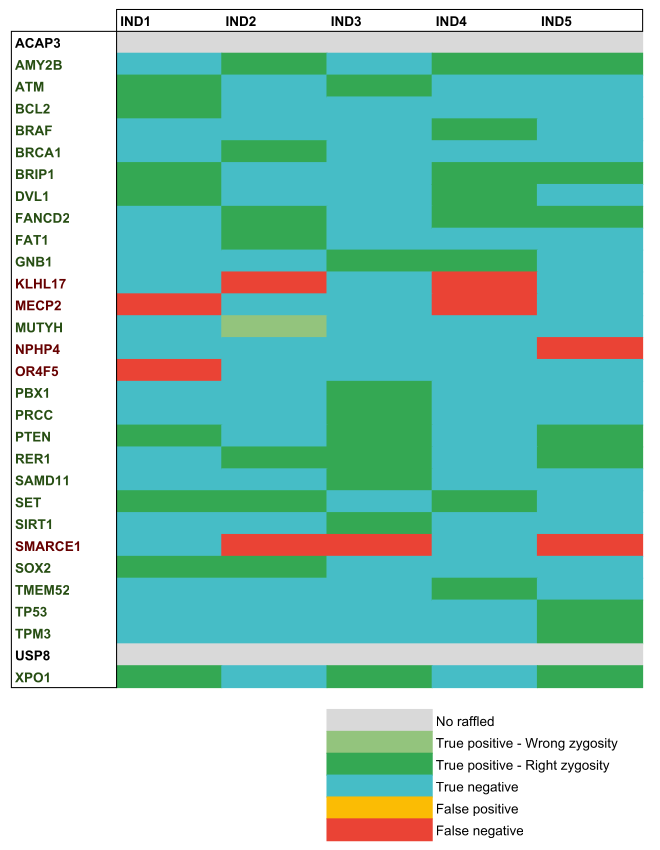

.. _chap_result:

*******
Results
*******

To assess **sideRETRO** performance and accuracy, we made a simulated
dataset whereupon we could have control of **true** positive and
negative values.

Dataset
========

Our dataset for testing is composed of 5 simulated human whole-genome
sequencing with 40x of depth and 10 randomly distributed retrocopies
each. In total, we had a list of 30 retrocopies consisting of the last
1000 bases of the largest transcript of the parental gene. All retrocopies
was stochastically designed for chromosome, position, strand and zygosity.

.. table:: 30 parental gene names chosen for the simulation
   :widths: auto

   +--------+--------+-------+---------+-------+
   | ACAP3  | AMY2B  | ATM   | BCL2    | BRAF  |
   +--------+--------+-------+---------+-------+
   | BRCA1  | BRIP1  | DVL1  | FANCD2  | FAT1  |
   +--------+--------+-------+---------+-------+
   | GNB1   | KLHL17 | MECP2 | MUTYH   | NPHP4 |
   +--------+--------+-------+---------+-------+
   | OR4F5  | PBX1   | PRCC  | PTEN    | RER1  |
   +--------+--------+-------+---------+-------+
   | SAMD11 | SET    | SIRT1 | SMARCE1 | SOX2  |
   +--------+--------+-------+---------+-------+
   | TMEM52 | TP53   | TPM3  | USP8    | XPO1  |
   +--------+--------+-------+---------+-------+

For each individual human whole-genome, we **sampled with replacement**
10 retrocopies from our list, so that some events were shared among
part of our subjects.

.. table:: All randomly designed retrocopies for simulation. \*HE heterozygous
   and \*HO homozygous alternate
   :widths: auto

   +---------------+------------+-----------+--------+----------+
   | Parental gene | Chromosome | Position  | Strand | Zygosity |
   +===============+============+===========+========+==========+
   | AMY2B         | chr5       | 122895832 |  \-    | HE       |
   +---------------+------------+-----------+--------+----------+
   | ACAP3         | chr11      | 133246346 |  \+    | H0       |
   +---------------+------------+-----------+--------+----------+
   | ATM           | chr19      | 16443740  |  \+    | HO       |
   +---------------+------------+-----------+--------+----------+
   | BCL2          | chr4       | 146453786 |  \+    | HO       |
   +---------------+------------+-----------+--------+----------+
   | BRAF          | chr18      | 22375812  |  \-    | HO       |
   +---------------+------------+-----------+--------+----------+
   | BRCA1         | chr7       | 102911369 |  \-    | HO       |
   +---------------+------------+-----------+--------+----------+
   | BRIP1         | chr12      | 113357216 |  \-    | HO       |
   +---------------+------------+-----------+--------+----------+
   | DVL1          | chr5       | 54105196  |  \-    | HE       |
   +---------------+------------+-----------+--------+----------+
   | FANCD2        | chr3       | 121339674 |  \+    | HE       |
   +---------------+------------+-----------+--------+----------+
   | FAT1          | chr16      | 65659952  |  \-    | HE       |
   +---------------+------------+-----------+--------+----------+
   | GNB1          | chr12      | 70734022  |  \+    | HE       |
   +---------------+------------+-----------+--------+----------+
   | MUTYH         | chr4       | 2716745   |  \+    | HO       |
   +---------------+------------+-----------+--------+----------+
   | PBX1          | chr21      | 22718521  |  \-    | HE       |
   +---------------+------------+-----------+--------+----------+
   | PRCC          | chr1       | 190777903 |  \-    | HO       |
   +---------------+------------+-----------+--------+----------+
   | PTEN          | chr2       | 140252560 |  \-    | HE       |
   +---------------+------------+-----------+--------+----------+
   | RER1          | chr13      | 55179109  |  \+    | HE       |
   +---------------+------------+-----------+--------+----------+
   | SAMD11        | chr4       | 14585135  |  \+    | HO       |
   +---------------+------------+-----------+--------+----------+
   | SET           | chr7       | 154178578 |  \-    | HO       |
   +---------------+------------+-----------+--------+----------+
   | SIRT1         | chrX       | 120716688 |  \-    | HO       |
   +---------------+------------+-----------+--------+----------+
   | SOX2          | chr10      | 88689163  |  \-    | HE       |
   +---------------+------------+-----------+--------+----------+
   | TMEM52        | chr1       | 82897536  |  \+    | HO       |
   +---------------+------------+-----------+--------+----------+
   | TP53          | chr5       | 42938944  |  \-    | HO       |
   +---------------+------------+-----------+--------+----------+
   | TPM3          | chr7       | 3488208   |  \-    | HE       |
   +---------------+------------+-----------+--------+----------+
   | USP8          | chr7       | 41333317  |  \+    | HO       |
   +---------------+------------+-----------+--------+----------+
   | XPO1          | chr10      | 33172062  |  \-    | HE       |
   +---------------+------------+-----------+--------+----------+

.. table:: Parental gene name for the retrocopies sampled by individual whole-genome
   :widths: auto

   +-------+---------+------+--------+---------+
   | IND1  | IND2    | IND3 | IND4   | IND5    |
   +=======+=========+======+========+=========+
   | ATM   | AMY2B   | ATM  | AMY2B  | AMY2B   |
   +-------+---------+------+--------+---------+
   | BCL2  | BRCA1   | GNB1 | BRAF   | BRIP1   |
   +-------+---------+------+--------+---------+
   | BRIP  | FANCD2  | MECP | BRIP1  | FANCD2  |
   +-------+---------+------+--------+---------+
   | DVL1  | FAT1    | PBX1 | DVL1   | NPHP4   |
   +-------+---------+------+--------+---------+
   | MECP  | KLHL17  | PRCC | FANCD2 | PTEN    |
   +-------+---------+------+--------+---------+
   | OR4F  | MUTYH   | PTEN | GNB1   | RER1    |
   +-------+---------+------+--------+---------+
   | PTEN  | RER1    | RER1 | KLHL17 | SMARCE1 |
   +-------+---------+------+--------+---------+
   | SET   | SET     | SAMD | MECP2  | TP53    |
   +-------+---------+------+--------+---------+
   | SOX2  | SMARCE1 | SIRT | SET    | TPM3    |
   +-------+---------+------+--------+---------+
   | XPO1  | SOX2    | XPO1 | TMEM52 | XPO1    |
   +-------+---------+------+--------+---------+

Simulation
==========

We used the **SANDY** tool (version v0.23), *A straightforward and complete next-generation
sequencing read simulator* [1]_, for simulate all 5 genomes according to the structural
variations that we desgined and according to the sampling. SANDY demands 2 steps for the
task: First we indexed all retrocopies for each individual and then we could simulate all
whole-genome sequencing.

.. code-block:: sh

   # Reference genome
   REF_FASTA=hg38.fa

   # Coverage depth
   DEPTH=40

   # Retrocopies by individual
   IND=(ind1.txt ind2.txt ind3.txt ind4.txt ind5.txt)

   # Index all retrocopies
   for ind in "${IND[@]}"; do
     sandy variation add --structural-variation=${ind%%.txt} $ind
   done

   # Simulate all genomes
   for ind in "${IND[@]}"; do
     sandy_index=${ind%%.txt}
     sandy genome \
       --id='%i.%U_%c:%S-%E_%v' \
       --structural-variation=$sandy_index \
       --output-dir=$sandy_index \
       --jobs=20 \
       --seed=42 \
       --quality-profile='hiseq_101' \
       --coverage=$DEPTH \
       --verbose \
       $REF_FASTA
   done

As result we have a pair of FASTQ files (forward and reverse complement) for
each simulated individual. Next it is required to align our sequencing data
against the human reference genome in order to generate mapped files in SAM
format. We used BWA aligner (version 0.7.9) [2]_ for accomplish this task.

.. code-block:: sh

   # Individual directories with the
   # simulated data
   IND_DIR=(ind1 ind2 ind3 ind4 ind5)

   # Reference genome
   REF_FASTA=hg38.fa

   # Index reference genome
   bwa index $REF_FASTA

   # Alignment
   for ind in "${IND[@]}"; do
     bwa mem \
       -t 10 \
       $REF_FASTA \
       $ind/out_R1_001.fastq.gz \
       $ind/out_R2_001.fastq.gz > $ind/out.sam
   done

Running sideRETRO
=================

After our simulated dataset was ready, we could test the sideRETRO capabilities
to detect the designed somatic retrocopies.

.. code-block:: sh

   # Our simulated SAM files list
   LIST=(ind1/out.sam ind2/out.sam ind3/out.sam ind4/out.sam ind5/out.sam)

   # GENCODE annotation v31
   ANNOTATION=gencode.v31.annotation.gff3.gz

   # GENCODE reference genome
   REF_FASTA=hg38.fa

   # Run process-sample step
   sider process-sample \
     --cache-size=20000000 \
     --output-dir=result \
     --threads=5 \
     --max-distance=15000 \
     --alignment-frac=0.9 \
     --phred-quality=20 \
     --sorted \
     --log-file=ps.log \
     --annotation-file=$ANNOTATION \
     "${LIST[@]}"

   # Run merge-call step
   sider merge-call \
     --cache-size=20000000 \
     --epsilon=500 \
     --min-pts=20 \
     --genotype-support=5 \
     --near-gene-rank=3 \
     --log-file=mc.log \
     --threads=10 \
     --phred-quality=20 \
     --in-place \
     result/out.db

   # Finally run make-vcf
   sider make-vcf \
     --reference-file=$REF_FASTA \
     --prefix=simulation \
     result/out.db

Download
========

Our output :file:`simulation.vcf`, as well as the files to be indexed by SANDY,
:file:`ind1.txt`, :file:`ind2.txt`, :file:`ind3.txt`, :file:`ind4.txt` and
:file:`ind5.txt`, can be downloaded at
:download:`simulation.tar.gz <data/simulation.tar.gz>`.

Analysis
========

All retrocopies were detected except for 5 retrocopies from the following parental
genes that were not detected in any individual: :file:`KLHL17`, :file:`MECP2`,
:file:`NPHP4`, :file:`OR4F5` and :file:`SMARCE1`. In a manual check, those
retrocopies do not present :ref:`abnormal reads <chap_methodology>` in any
individual - which could enable their recognition by our pipeline. However to make a
fair and reproducible analysis, we will consider it as a methodological error of our
tool. So sideRETRO found :math:`\frac{23}{28}` retrocopies, which means **82%**.

In more detail, we will show that result and more concerning:

1) `Genomic coordinate`_
2) `Zygosity`_

Genomic coordinate
------------------

Regarding the genomic coordinate, sideRETRO got it right **100%** for **chromosome**
and **strand**. The performance in detecting the insertion point position was
satisfactory with a MEDSE of **1 base**.

.. table:: Predicted position. Error = :math:`|actualPos - predictedPos|`

   +---------------+------------------------+-------------------------+-------+
   | Parental gene | Actual position        | Predicted position      | Error |
   +===============+=======+===========+====+========+===========+====+=======+
   | AMY2B         | chr5  | 122895832 | \- |  chr5  | 122895831 | \- | 1     |
   +---------------+-------+-----------+----+--------+-----------+----+-------+
   | ATM           | chr19 | 16443740  | \+ |  chr19 | 16443738  | \+ | 2     |
   +---------------+-------+-----------+----+--------+-----------+----+-------+
   | BCL2          | chr4  | 146453786 | \+ |  chr4  | 146453783 | \+ | 3     |
   +---------------+-------+-----------+----+--------+-----------+----+-------+
   | BRAF          | chr18 | 22375812  | \- |  chr18 | 22375811  | \- | 1     |
   +---------------+-------+-----------+----+--------+-----------+----+-------+
   | BRCA1         | chr7  | 102911369 | \- |  chr7  | 102911368 | \- | 1     |
   +---------------+-------+-----------+----+--------+-----------+----+-------+
   | BRIP1         | chr12 | 113357216 | \- |  chr12 | 113357216 | \- | 0     |
   +---------------+-------+-----------+----+--------+-----------+----+-------+
   | DVL1          | chr5  | 54105196  | \- |  chr5  | 54105195  | \- | 1     |
   +---------------+-------+-----------+----+--------+-----------+----+-------+
   | FANCD2        | chr3  | 121339674 | \+ |  chr3  | 121339673 | \+ | 1     |
   +---------------+-------+-----------+----+--------+-----------+----+-------+
   | FAT1          | chr16 | 65659952  | \- |  chr16 | 65659951  | \- | 1     |
   +---------------+-------+-----------+----+--------+-----------+----+-------+
   | GNB1          | chr12 | 70734022  | \+ |  chr12 | 70734022  | \+ | 0     |
   +---------------+-------+-----------+----+--------+-----------+----+-------+
   | MUTYH         | chr4  | 2716745   | \+ |  chr4  | 2716760   | \+ | 15    |
   +---------------+-------+-----------+----+--------+-----------+----+-------+
   | PBX1          | chr21 | 22718521  | \- |  chr21 | 22718520  | \- | 1     |
   +---------------+-------+-----------+----+--------+-----------+----+-------+
   | PRCC          | chr1  | 190777903 | \- |  chr1  | 190777902 | \- | 1     |
   +---------------+-------+-----------+----+--------+-----------+----+-------+
   | PTEN          | chr2  | 140252560 | \- |  chr2  | 140252559 | \- | 1     |
   +---------------+-------+-----------+----+--------+-----------+----+-------+
   | RER1          | chr13 | 55179109  | \+ |  chr13 | 55179108  | \+ | 1     |
   +---------------+-------+-----------+----+--------+-----------+----+-------+
   | SAMD11        | chr4  | 14585135  | \+ |  chr4  | 14585134  | \+ | 1     |
   +---------------+-------+-----------+----+--------+-----------+----+-------+
   | SET           | chr7  | 154178578 | \- |  chr7  | 154178578 | \- | 0     |
   +---------------+-------+-----------+----+--------+-----------+----+-------+
   | SIRT1         | chrX  | 120716688 | \- |  chrX  | 120716687 | \- | 1     |
   +---------------+-------+-----------+----+--------+-----------+----+-------+
   | SOX2          | chr10 | 88689163  | \- |  chr10 | 88689162  | \- | 1     |
   +---------------+-------+-----------+----+--------+-----------+----+-------+
   | TMEM52        | chr1  | 82897536  | \+ |  chr1  | 82897534  | \+ | 2     |
   +---------------+-------+-----------+----+--------+-----------+----+-------+
   | TP53          | chr5  | 42938944  | \- |  chr5  | 42938943  | \- | 1     |
   +---------------+-------+-----------+----+--------+-----------+----+-------+
   | TPM3          | chr7  | 3488208   | \- |  chr7  | 3488207   | \- | 1     |
   +---------------+-------+-----------+----+--------+-----------+----+-------+
   | XPO1          | chr10 | 33172062  | \- |  chr10 | 33172056  | \- | 6     |
   +---------------+-------+-----------+----+--------+-----------+----+-------+

.. table:: Genomic coordinate detection summary.
   MSE (Mean Squared Error), MEDSE (Median Squared Error).

   +------------+--------+---------------------+
   |            |        | Position            |
   | Chromosome | Strand +------------+--------+
   |            |        | MSE        | MEDSE  |
   +============+========+============+========+
   | 100%       | 100%   | 12.7 bases | 1 base |
   +------------+--------+------------+--------+

.. note:: The retrocopies from :file:`MUTYH` and :file:`XPO1` do not present
   :ref:`splitted reads <chap_methodology>`, so they are annotated as *IMPRECISE*
   at :file:`simulation.vcf` file. So it can explain why their insertion point position
   detection has the biggest absolute error, which pulls the MSE up.

Zygosity
--------

With the exception of the 5 undetected retrocopies (parental genes :file:`KLHL17`,
:file:`MECP2`, :file:`NPHP4`, :file:`OR4F5` and :file:`SMARCE1`), it was possible
to accurately calculate the zygosity. Only for the :file:`MUTYH`'s retrocopy, the
zygosity was wrongly assigned as heterozygous for the individual :file:`IND2` - when
the true value was *homozygous alternate*. As :file:`MUTYH`'s retrocopy was
*imprecisely* annotated for the lack of splitted reads, we may expect a reference
allele depth overestimation on the predicted site - which explains the heterozygous
attribution.

   Heatmap summarizing the result for each individual

To calculate the performance in terms of reference/alternate allele detection, we
made a confusion matrix for each individual and an overall matrix with the junction
of all simulations:

.. figure:: images/result_confusion.png
   :scale: 100%
   :figwidth: 100%
   :align: left

   Confusion matrix of alleles detection performance

   +-----+----------------------------------------+
   | TP  | True Positive                          |
   +-----+----------------------------------------+
   | FP  | False Positive                         |
   +-----+----------------------------------------+
   | TN  | True Negative                          |
   +-----+----------------------------------------+
   | FN  | False Negative                         |
   +-----+----------------------------------------+
   | TPR | True Positive Rate or Sensitivity      |
   +-----+----------------------------------------+
   | TNR | True Negative Rate or Specificity      |
   +-----+----------------------------------------+
   | PPV | Positive Predictive Value or Precision |
   +-----+----------------------------------------+
   | NPV | Negative Predictive Value              |
   +-----+----------------------------------------+
   | ACC | Accuracy                               |
   +-----+----------------------------------------+

There was no *false positive* at all - as can be seen by the **precision** and
**specificity** with 100% value for all individuals. The worst **accuracy** was
at individual 2, with 91.07% value, and best was at individual 3, with 96.43%
value. The overall **sensitivity**, **specificity** and **accuracy** were: 81%,
100% and 93.21% value consecutively.

References and Further Reading
==============================

.. [1] Miller, Thiago et al. (2019).
   galantelab/sandy: Release v0.23 (Version v0.23).
   Zenodo. http://doi.org/10.5281/zenodo.2589575.

.. [2] Li H. and Durbin R. (2009).
   Fast and accurate short read alignment with Burrows-Wheeler Transform.
   Bioinformatics, 25:1754-60. [PMID: 19451168].
