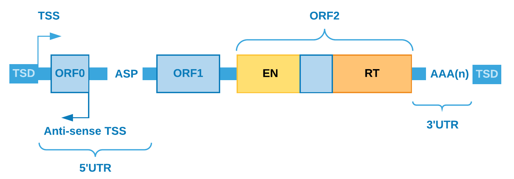

.. _chap_retrocopy:

***********************
Retrocopy in a nutshell
***********************

In the late 1940s, Barbara McClintock discovered the controlling elements,
later known as transposons [1]_.

   Image of Barbara McClintock. Cold Spring Harbor Laboratory Archives.
   Copyright © 2016 by the Genetics Society of America

These elements, also called transposable elements (TEs), collectively comprise more
than half of mammals’ genome [2]_ and for humans, approximately two-thirds
of the 3 billion base pair genome are the outcome of TEs activity [3]_.  TEs are
subdivided in DNA-transposons and retrotransposons, and the latter being the result
of retrotransposition process [4]_ [5]_. Those classes of TEs can be autonomous or
non-autonomous according to the presence or absence of their own enzymatic machinery
of (retro)transposition, respectively. In retrotransposons, the most prominent autonomous
elements are LINEs (Long Interspersed Nuclear Elements), and from the non-autonomous class,
they are SINEs (Short Interspersed Nuclear Elements) together with processed pseudogenes
or retrocopies of mRNAs (retrotransposed protein-coding genes).

LINE
====

LINEs became the most frequent transposable element, in number of nucleotides,
corresponding to approximately 17% of the human genome [6]_. In our genome, the most
numerous family of LINEs is LINE-1 (L1) and when its sequence is full-lenght (about 6 kb),
this element has: i) one promoter region; ii) a 5’UTR region; iii) two coding regions (ORF1p
and ORF2p); iv) a 3’UTR region; v) a poly-A tail inside its transcript; vi) and recently a
distinct ORF (ORF0, which is 70 amino acids in length, but still with unknown function) was
found in primates [7]_ [8]_.

ORF1p encodes a RNA-binding protein, responsible for the mRNA
binding specificity, and ORF2p encodes a dual function protein working as reverse transcriptase
and endonuclease. Together, the coding regions of L1s are accountable for shaping the
retrotransposase and this machinery can operate in cis making retrocopies of the element itself,
or in trans retrocopying non-autonomous repetitive elements, like SINEs and mRNAs transcripts
[9]_ [10]_. In this process, from mRNA, a cDNA is generated (by retrotranscription) and then
randomly inserted back to the nuclear genome, giving birth to a (retro)copy from the
original/parental element.

SINE
====

SINEs, one of the elements retrotransposed by L1 retrotransposase, account for approximately 11%
of the human genome and its most frequent family is Alu with average length of 300bp [11]_. Alu is
a primate-specific element and has (when in full-length mode) 5’ end with internal hallmarks of RNA
polymerase III linked by an A-rich region to a 3’ end with an oligo-dA-rich sequence that acts as
target to the reverse transcription [12]_. As well as SINEs, retrocopies of coding genes depend on
L1 machinery and they are one of the major sources of de novo genetic variations [13]_, potentially
contributing also to genetic diseases [14]_. Nowadays, we know that retrotransposition events are very
frequent in many organisms, with more than 1 million copies of Alu [9]_ and more than 7,800
retroduplication events of coding genes in our genome [15]_ [16]_.

Retrocopy and diseases
======================

In somatic cells, retrotransposition events are repressed by post-transcriptional and epigenetics
modifications, but the temporary loss of these controls can lead to new insertions resulting in
structural modifications accountable for diseases, as colorectal and lung cancers [17]_ [18]_ [19]_.
Recently, some authors showed that, in tumorigenic process, there is a strong correlation between
colorectal cancer (CRC) progression and the loss of methylation in regions containing LINEs, from
the most methylated (normal mucosa) to the least methylated (CRC metastasis), suggesting that LINEs
could act as an important marker for CRC progression [20]_ [21]_.  Alu elements are also rich in CpG
residues and, as in LINEs, the methylation of these elements appears to decrease in many tumors
contributing to the development of diseases by either altering the expression of some genes in several
ways, disrupting a coding region or splice signal [11]_. In 2016, Clayton et al. [22]_ showed a
potentially tumorigenic Alu insertion in the enhancer region of the tumor suppressor gene CBL in a
breast cancer sample [22]_. However, although many studies have highlighted Alu elements as sources of
genetic instability and their contribution to carcinogenesis [23]_ [24]_, other high throughput studies
have hidden Alu elements due to the difficulties in developing efficient methods to identify these
elements in a tumorigenic context [11]_.  Retrocopies were also described in tumorigenic context, as
the classical case of PTEN and its retrocopy PTEN1 [25]_. In this paper, Poliseno and others show the
critical consequences of the interaction between PTEN and PTENP1, where the retrocopy (pseudogene) is
active, regulates coding gene expression by regulating cellular levels of PTEN and is also selectively
deleted in cancer. Therefore, finding these retrotranscribed elements became very important in
understanding their potential functions in tumorigenesis and tumor heterogeneity.

References and Further Reading
==============================

.. [1] McCLINTOCK, 1950.

.. [2] BURNS, 2017.

.. [3] DE KONING et al., 2011.

.. [4] KAESSMANN, 2010.

.. [5] HELMAN et al., 2014.

.. [6] LANDER et al., 2001.

.. [7] HANCKS and KAZAZIAN, 2016.

.. [8] DENLI et al. 2015.

.. [9] BATZER and DEININGER, 2002.

.. [10] KAESSMANN et al., 2009.

.. [11] DEININGER, 2011.

.. [12] BAKSHI et al. 2016.

.. [13] BECK et al., 2010.

.. [14] LEE et al., 2012.

.. [15] NAVARRO and GALANTE, 2013.

.. [16] NAVARRO and GALANTE, 2015.

.. [17] MIKI et al., 1992.

.. [18] SOLYOM et al., 2012.

.. [19] COOKE et al., 2014.

.. [20] SUNAMI et al. 2011.

.. [21] HUR et al., 2014.

.. [22] CLAYTON et al. 2016

.. [23] DEININGER and BATZER, 1999.

.. [24] BELANCIO et al. 2010.

.. [25] POLISENO et al, 2010.
